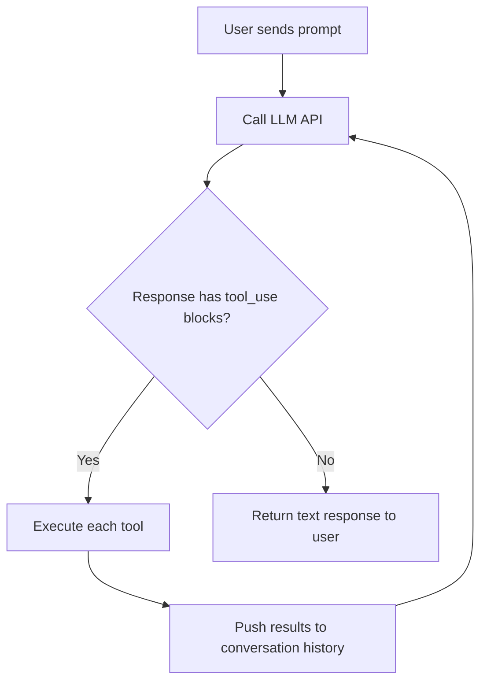

# Chapter 1: The Agentic Loop

## The problem

When you use a regular chatbot, you send a message, you get a response, and that is it. One turn. But coding tasks are never one turn. "Add a dark mode toggle" requires finding files, reading them, understanding the code, making edits, running tests, and maybe fixing what the tests caught.

How do you make an AI do all of that from a single prompt?

## What a real task looks like

Let's say a user types: "Add a dark mode toggle to the settings page."

Here is what an AI coding agent actually does:

```
Turn 1:  [tool] search for settings-related files
Turn 2:  [tool] read Settings.tsx
Turn 3:  [tool] read the theme config file
Turn 4:  [tool] search for existing dark mode code
Turn 5:  [tool] edit the theme config to add dark colors
Turn 6:  [tool] edit Settings.tsx to add a toggle switch
Turn 7:  [tool] run the tests
Turn 8:  [text] "Done. I added a dark mode toggle to..."
```

Eight turns. Seven of them are tool calls. Only the last one is actual text for the user. The model decided on its own what to search, what to read, what to edit, and when it was done.

This is what "agentic" means. The model is not just answering a question. It is making decisions, taking actions, and repeating until the job is done.

## What is a "tool"?

Before we look at the loop, let's clarify what "tool" means here.

Most LLM APIs (Claude, GPT, Gemini, etc.) support a feature called "tool use" or "function calling." You can tell the model about functions it is allowed to use. "You have a function called `read_file` that takes a file path and returns the file contents." These functions are called **tools**.

The model does not run the tools itself. It can only *ask* you to run them. When the model decides it needs to read a file, it responds with a special block called `tool_use`:

```json
{
  "type": "tool_use",
  "name": "read_file",
  "input": { "file_path": "src/App.tsx" }
}
```

This is the model saying: "I want to call `read_file` with this input. Please run it and tell me the result."

Your code then executes the function, gets the result, and sends it back to the model as a `tool_result` block. What does "execute the function" look like? At its simplest, it is just a function:

```typescript
function executeTool(name: string, input: Record<string, string>): string {
  if (name === "read_file") {
    return fs.readFileSync(input.file_path, "utf-8");
  }
  if (name === "list_files") {
    return fs.readdirSync(input.directory).join("\n");
  }
  return "Unknown tool";
}
```

A tool is just a function. The model says "call `read_file` with this path", your code reads the file from disk, and you send the contents back. Nothing more. We will build a proper set of tools in Chapter 2, including how to organize them, validate inputs, and handle errors. For now, this is all you need to understand the loop below.

## The loop

The whole thing is a `while(true)` loop wrapped in a function. First, you set up the API client and define what tools the model can use:

```typescript
import Anthropic from "@anthropic-ai/sdk";

const client = new Anthropic(); // reads ANTHROPIC_API_KEY from environment

// Tell the model what tools it has (Chapter 2 covers this in detail)
const tools: Anthropic.Tool[] = [
  {
    name: "get_time",
    description: "Get the current date and time",
    input_schema: { type: "object", properties: {}, required: [] },
  },
];
```

Each tool has a `name`, a `description` (so the model knows what it does), and an `input_schema` that describes what arguments it accepts. The schema uses [JSON Schema](https://json-schema.org/) format. `properties` lists the arguments and their types, `required` lists which ones are mandatory. This `get_time` tool takes no arguments, so both are empty. A tool that reads a file would look like:

```typescript
{
  name: "read_file",
  description: "Read a file from disk",
  input_schema: {
    type: "object",
    properties: {
      file_path: { type: "string", description: "Path to the file" },
    },
    required: ["file_path"],
  },
}
```

The model reads these definitions and knows: "I can call `read_file` with a `file_path` string." We will build real tools in Chapter 2.

Then the agentic loop itself:

```typescript
async function agentLoop(
  conversationHistory: Anthropic.MessageParam[]
): Promise<string> {
  while (true) {
    // 1. Send the conversation to the API
    const response = await client.messages.create({
      model: "claude-sonnet-4-20250514",
      max_tokens: 4096,
      tools,
      messages: conversationHistory,
    });

    // 2. Add the assistant's response to history
    conversationHistory.push({ role: "assistant", content: response.content });

    // 3. Check if the model used any tools
    const toolUseBlocks = response.content.filter(
      (block): block is Anthropic.ToolUseBlock => block.type === "tool_use"
    );

    if (toolUseBlocks.length === 0) {
      // No tools called. The model is done. Extract the text and return it.
      const textBlocks = response.content.filter(
        (block): block is Anthropic.TextBlock => block.type === "text"
      );
      return textBlocks.map((b) => b.text).join("\n");
    }

    // 4. Execute each tool and collect results
    const toolResults: Anthropic.ToolResultBlockParam[] = [];
    for (const toolUse of toolUseBlocks) {
      const result = executeTool(toolUse.name, toolUse.input);
      toolResults.push({
        type: "tool_result",
        tool_use_id: toolUse.id,
        content: result,
      });
    }

    // 5. Push tool results back into the conversation as a user message
    conversationHistory.push({ role: "user", content: toolResults });

    // 6. Loop back to step 1
  }
}
```

That is the entire architecture. The function takes the conversation history, runs the loop until the model stops calling tools, and returns the final text response. Everything else in this guide is adding features on top of this loop.

## How it works, step by step

Let's trace through what happens when the user says "read the README file":

**Step 1**: We send the conversation to the API. The messages array looks like:

```json
[
  { "role": "user", "content": "read the README file" }
]
```

**Step 2**: The API responds with a `tool_use` block:

```json
{
  "content": [
    {
      "type": "tool_use",
      "id": "toolu_abc123",
      "name": "read_file",
      "input": { "file_path": "README.md" }
    }
  ],
  "stop_reason": "tool_use"
}
```

**Step 3**: We see a `tool_use` block, so we do not break. We execute the tool (read the file) and get the contents back.

**Step 4**: We push the tool result back as a user message:

```json
[
  { "role": "user", "content": "read the README file" },
  { "role": "assistant", "content": [{ "type": "tool_use", ... }] },
  { "role": "user", "content": [{ "type": "tool_result", "tool_use_id": "toolu_abc123", "content": "# My Project\n..." }] }
]
```

**Step 5**: We loop back to step 1. The model now sees its own tool call AND the result. It has the file contents in front of it. It can now decide: do I need to call another tool, or can I respond with text?

If it responds with just text (no `tool_use` blocks), the loop breaks. Done.

If it calls another tool, we repeat the cycle.

## The flow



This is the entire agentic loop. Every AI coding agent works this way. The difference between a simple agent and a production one is everything we add around this loop in the following chapters.

## Check for tool_use blocks, not stop_reason

You might think you should check `response.stop_reason === "tool_use"` to know if tools were called. Do not rely on that. The `stop_reason` field is not always reliable. Sometimes it says `end_turn` even when the response contains tool calls.

Instead, check the actual content:

```typescript
const toolUseBlocks = response.content.filter(
  block => block.type === "tool_use"
);

if (toolUseBlocks.length === 0) {
  break; // No tools, we are done
}
```

This is what production agents do. Look at what the model actually returned, not what the metadata says.

## Exit conditions

The loop does not run forever. There are several reasons to stop:

| Condition | What happens |
|---|---|
| **No tool calls** | The model responded with just text. It decided it is done. This is the normal exit. |
| **Max turns reached** | Safety limit. If the model has been looping for 50 turns, something is probably wrong. Break out. |
| **User cancelled** | The user hit Ctrl+C or an abort signal was triggered. |
| **Context too long** | The conversation history got too big for the model's context window. We will handle this in Chapter 6. |
| **API error** | The model returned an error (rate limit, server error, etc.). |

Production agents have even more exit conditions, but these five cover the important ones.

For now, we only implement the first two (no tool calls = done, max turns = safety stop). We will add the others as we go.

## The key insight

The word "agent" sounds like something complex. It is not. The model's output becomes its own input on the next turn. That is the whole trick. The loop does not make decisions. The model does. The loop just keeps asking "what now?" and the model keeps answering until it decides to stop.

```
model output --> tool results --> model input (next turn)
```

The loop is dumb. The model is smart. Your job is to give the model tools (next chapter) and keep the loop running.

## What is still missing

Our loop has no tools. The model cannot read files, search code, or run commands. It can only respond with text. In the next chapter, we will give it eyes and hands.

## The REPL

We have `agentLoop()` but we need a way for the user to type messages and see responses. The example uses a simple REPL (read-eval-print loop) with Node's `readline` module:

```typescript
import * as readline from "readline";

async function main() {
  const conversationHistory: Anthropic.MessageParam[] = [];

  const rl = readline.createInterface({
    input: process.stdin,
    output: process.stdout,
  });

  const ask = () => {
    rl.question("> ", async (input) => {
      const trimmed = input.trim();
      if (!trimmed) return ask();

      // Add user message to history
      conversationHistory.push({ role: "user", content: trimmed });

      // Run the agentic loop
      const response = await agentLoop(conversationHistory);
      console.log(`\n${response}\n`);

      // Ask for the next message
      ask();
    });
  };

  ask();
}

main();
```

The user types a message, it gets added to the conversation history, the agentic loop runs (possibly calling tools multiple times), and the final text response is printed. Then the REPL asks for the next message. The conversation history carries forward, so follow-up messages have the full context.

This REPL is the outer shell around the agentic loop. Every example in this guide uses the same pattern.

## Running the example

```bash
npm run example:01
```

The example uses a `get_time` tool so you can see the cycle in action. Try "what time is it?" and watch the model call the tool and use the result.
