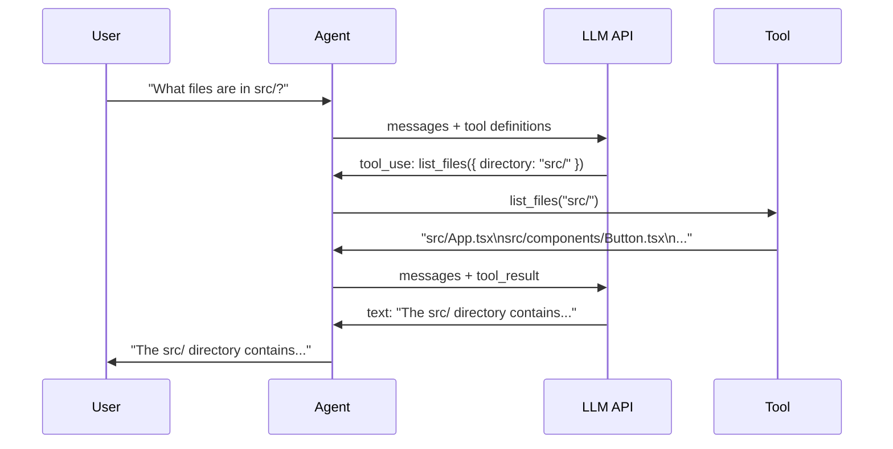

# Chapter 2: Tools

## The problem

Our agent from Chapter 1 has a brain but no body. It can think and talk, but it cannot see your files, search your code, or run commands. Without tools, it is just a chatbot.

Tools are how the model interacts with the real world. Each tool is a function that the model can call. "Read this file." "Search for this pattern." "Run this command." The model picks which tool to use, what arguments to pass, and we execute it.

## Walkthrough: "What is in the README?"

The user types: "What is in the README?"

Without tools, the model can only guess. With a `read_file` tool, here is what happens:

```
Turn 1:
  Model thinks: "I need to read the file to answer this."
  Model calls:  read_file({ file_path: "README.md" })
  We execute:   fs.readFileSync("README.md", "utf-8")
  We return:    "# My Project\nA simple React app..."

Turn 2:
  Model sees:   Its own tool call + the file contents
  Model says:   "The README contains a project description for..."
  No tools called. Loop exits.
```

Two turns. One tool call. The model decided to read the file, got the contents, and answered the question. We did not tell it to use the read tool. It figured that out on its own.

## The tool interface

Every tool needs two things:

1. **A definition** that tells the model what the tool does (name, description, and what input it accepts)
2. **An implementation** that actually does the work

The definition is what the model sees. It uses JSON Schema to describe the input format. Here is what a `read_file` tool definition looks like when sent to the API:

```json
{
  "name": "read_file",
  "description": "Read the contents of a file.",
  "input_schema": {
    "type": "object",
    "properties": {
      "file_path": {
        "type": "string",
        "description": "The path to the file to read"
      }
    },
    "required": ["file_path"]
  }
}
```

The model reads this and knows: "I can call `read_file` with a `file_path` string." That is all the model needs.

On our side, we need to organize our tools and validate the input the model sends (it can make mistakes). We use a simple interface:

```typescript
interface Tool {
  name: string;
  description: string;
  inputSchema: z.ZodObject<any>;
  call(input: Record<string, unknown>): Promise<string>;
}
```

The `inputSchema` here uses [Zod](https://zod.dev/), a TypeScript validation library. We use it for two reasons: it validates the model's input at runtime (catching bad arguments before they cause errors), and we can convert it to the JSON Schema format the API expects. You could use plain JSON Schema instead, but Zod makes validation easier.

When the model calls a tool, we validate the input with Zod first. If it is wrong, we send an error back instead of crashing.

## The essential tools

You only need a few tools to cover most coding tasks:

| Tool | What it does | Example |
|---|---|---|
| **read_file** | Read a file from disk | Read "src/App.tsx" |
| **write_file** | Create or overwrite a file | Create "src/utils.ts" |
| **edit_file** | Replace a specific string in a file | Change "blue" to "red" |
| **run_command** | Execute a shell command | Run "npm test" |
| **list_files** | Find files by pattern | Find all "*.tsx" files |
| **search_files** | Search file contents with regex | Find "useState" in all files |

With these six tools, an agent can do almost everything a developer does. The edit tool is special enough to get its own chapter (Chapter 3). For now, we will build the other five.

## Building the tools

### read_file

The simplest and most used tool. The model calls it constantly.

```typescript
const readFileTool: Tool = {
  name: "read_file",
  description: "Read the contents of a file. Returns the file content with line numbers.",
  inputSchema: z.object({
    file_path: z.string().describe("The path to the file to read"),
  }),
  async call(input) {
    const content = fs.readFileSync(input.file_path as string, "utf-8");
    const lines = content.split("\n");
    // Add line numbers so the model can reference specific lines
    return lines.map((line, i) => `${i + 1}\t${line}`).join("\n");
  },
};
```

We add line numbers to the output. This helps the model reference specific lines when it wants to make edits later. It is a small thing that makes a big difference.

### run_command

Runs a shell command and returns the output. This is powerful and dangerous, which is why Chapter 7 (Permissions) exists.

```typescript
const runCommandTool: Tool = {
  name: "run_command",
  description: "Run a shell command and return its output.",
  inputSchema: z.object({
    command: z.string().describe("The shell command to run"),
  }),
  async call(input) {
    try {
      const output = execSync(input.command as string, {
        encoding: "utf-8",
        timeout: 30_000,   // 30 second timeout
        maxBuffer: 1024 * 1024,  // 1MB max output
      });
      return output;
    } catch (err: any) {
      return `Error (exit code ${err.status}): ${err.stderr || err.message}`;
    }
  },
};
```

Notice the timeout and max buffer. Without these, a command like `yes` (which prints "y" forever) would hang your agent. Always put limits on shell commands.

### list_files

Finds files in a directory. The model uses this to explore the codebase before reading specific files.

```typescript
const listFilesTool: Tool = {
  name: "list_files",
  description: "List files in a directory recursively. Skips node_modules and hidden files.",
  inputSchema: z.object({
    directory: z.string().optional().describe("Directory to list. Defaults to current directory."),
  }),
  async call(input) {
    const dir = (input.directory as string) || ".";
    const files: string[] = [];

    function walk(d: string) {
      for (const entry of fs.readdirSync(d, { withFileTypes: true })) {
        if (entry.name.startsWith(".") || entry.name === "node_modules") continue;
        const full = path.join(d, entry.name);
        if (entry.isDirectory()) walk(full);
        else files.push(full);
      }
    }

    walk(dir);
    return files.join("\n") || "(empty directory)";
  },
};
```

We skip `node_modules` and hidden files. Without this filter, the model would drown in thousands of irrelevant files.

### search_files

Searches file contents with a regex pattern. Like `grep` but returns results the model can use.

```typescript
const searchFilesTool: Tool = {
  name: "search_files",
  description: "Search for a pattern in files. Returns matching lines with file paths and line numbers.",
  inputSchema: z.object({
    pattern: z.string().describe("Regex pattern to search for"),
    directory: z.string().optional().describe("Directory to search. Defaults to current directory."),
  }),
  async call(input) {
    const dir = (input.directory as string) || ".";
    const regex = new RegExp(input.pattern as string);
    const results: string[] = [];

    function search(d: string) {
      for (const entry of fs.readdirSync(d, { withFileTypes: true })) {
        if (entry.name.startsWith(".") || entry.name === "node_modules") continue;
        const full = path.join(d, entry.name);
        if (entry.isDirectory()) {
          search(full);
        } else {
          try {
            const lines = fs.readFileSync(full, "utf-8").split("\n");
            lines.forEach((line, i) => {
              if (regex.test(line)) {
                results.push(`${full}:${i + 1}: ${line.trim()}`);
              }
            });
          } catch {
            // Skip files we cannot read (binary files, etc.)
          }
        }
      }
    }

    search(dir);
    return results.slice(0, 50).join("\n") || "No matches found.";
  },
};
```

We limit results to 50 lines. Without a limit, a common pattern like `import` could return thousands of matches and eat up the model's context window.

### write_file

Creates a new file or overwrites an existing one. For edits to existing files, we will use the edit tool (Chapter 3). This tool is for creating new files.

```typescript
const writeFileTool: Tool = {
  name: "write_file",
  description: "Write content to a file. Creates the file if it does not exist. Overwrites if it does.",
  inputSchema: z.object({
    file_path: z.string().describe("The path to the file to write"),
    content: z.string().describe("The content to write"),
  }),
  async call(input) {
    const filePath = input.file_path as string;
    fs.mkdirSync(path.dirname(filePath), { recursive: true });
    fs.writeFileSync(filePath, input.content as string);
    return `File written: ${filePath}`;
  },
};
```

## Wiring tools into the loop

Now we connect the tools to our agentic loop from Chapter 1. First, collect all tools into an array:

```typescript
const tools: Tool[] = [
  readFileTool,
  writeFileTool,
  listFilesTool,
  searchFilesTool,
  runCommandTool,
];
```

Then two things change:

**1. Register tools with the API.** We convert our Zod schemas to JSON Schema and pass them in the `tools` parameter:

```typescript
const apiTools = tools.map(tool => ({
  name: tool.name,
  description: tool.description,
  input_schema: zodToJsonSchema(tool.inputSchema),
}));

const response = await client.messages.create({
  model: "claude-sonnet-4-20250514",
  max_tokens: 4096,
  tools: apiTools,
  messages: conversationHistory,
});
```

**2. Find and execute the right tool.** When the model returns a `tool_use` block, we look up the tool by name, validate the input, and call it:

```typescript
for (const toolUse of toolUseBlocks) {
  const tool = tools.find(t => t.name === toolUse.name);
  if (!tool) {
    toolResults.push({
      type: "tool_result",
      tool_use_id: toolUse.id,
      content: `Unknown tool: ${toolUse.name}`,
      is_error: true,
    });
    continue;
  }

  // Validate the input
  const parsed = tool.inputSchema.safeParse(toolUse.input);
  if (!parsed.success) {
    toolResults.push({
      type: "tool_result",
      tool_use_id: toolUse.id,
      content: `Invalid input: ${parsed.error.message}`,
      is_error: true,
    });
    continue;
  }

  // Execute the tool
  const result = await tool.call(parsed.data);
  toolResults.push({
    type: "tool_result",
    tool_use_id: toolUse.id,
    content: result,
  });
}
```

Notice the `is_error: true` flag. When a tool call fails (unknown tool, invalid input, runtime error), we still return a result. We just mark it as an error. The model sees the error and can try again or take a different approach. Never crash. Always return something.

## The flow



## What happens in a real session

Here is what a multi-tool session looks like when the user asks "what does the Button component do?":

```
> what does the Button component do?

  [tool] list_files({ directory: "sample-project/src" })
  [result] sample-project/src/App.tsx
           sample-project/src/components/Button.tsx
           sample-project/src/components/Header.tsx

  [tool] read_file({ file_path: "sample-project/src/components/Button.tsx" })
  [result] 1  interface ButtonProps {
           2    label?: string;
           3    onClick?: () => void;
           4  }
           ...

The Button component is a reusable button that accepts a label
and an onClick handler...
```

The model searched for files, found the Button component, read it, and explained it. Three turns, two tool calls, one text response. We never told it which file to read. It figured that out from the file listing.

## What is still missing

The model can read files but it cannot edit them. In the next chapter, we will build the edit tool. And the way it edits files is probably not what you expect.

## Running the example

```bash
npx tsx examples/02-with-tools.ts
```

Try prompts like:
- "What files are in the sample project?"
- "Read the Button component"
- "Search for className in the sample project"
