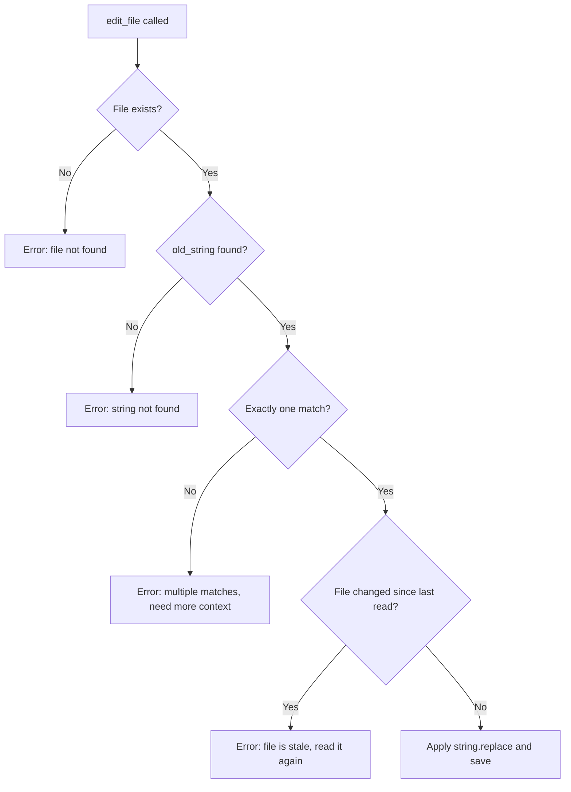

# Chapter 3: The Edit Tool

## The problem

The model can read files now. But how does it edit them?

You might expect something complex. Maybe it parses the code into an AST (abstract syntax tree) and manipulates nodes. Maybe it uses a diff algorithm. Maybe it works with line numbers and inserts or deletes specific lines.

It does none of that. It uses `string.replace()`. That is the whole thing.

## Walkthrough: "Change the button color to red"

The user types: "Change the button color to red in the sample project."

Here is what happens:

```
Turn 1:
  [tool] list_files({ directory: "sample-project/src" })
  [result] sample-project/src/App.tsx
           sample-project/src/components/Button.tsx
           sample-project/src/components/Header.tsx

Turn 2:
  [tool] read_file({ file_path: "sample-project/src/components/Button.tsx" })
  [result] 1   interface ButtonProps {
           2     label?: string;
           3     onClick?: () => void;
           4   }
           5
           6   export function Button({ label = "Get Started", onClick }: ButtonProps) {
           7     return (
           8       <button
           9         onClick={onClick}
           10        className="bg-blue-500 text-white px-6 py-2 rounded-lg hover:bg-blue-600"
           11      >
           12        {label}
           13      </button>
           14    );
           15  }

Turn 3:
  [tool] edit_file({
    file_path: "sample-project/src/components/Button.tsx",
    old_string: "bg-blue-500 text-white px-6 py-2 rounded-lg hover:bg-blue-600",
    new_string: "bg-red-500 text-white px-6 py-2 rounded-lg hover:bg-red-600"
  })
  [result] Edited sample-project/src/components/Button.tsx

Turn 4:
  [text] "I changed the button color from blue to red..."
```

The model searched for files, read the button component, and replaced the old string with a new one. Under the hood, this is what the edit tool did:

```typescript
const updated = fileContent.replace(oldString, newString);
fs.writeFileSync(filePath, updated);
```

That is it. `string.replace()`.

One small detail: production implementations use a callback function for the replacement (`content.replace(search, () => replace)`) instead of passing the string directly. This prevents JavaScript from interpreting special patterns like `$1` or `$&` in the replacement string. If the user's new code happens to contain `$1`, you do not want it treated as a regex capture group reference.

## Why string.replace() works

It seems too simple, but there are good reasons this approach won:

**Line numbers drift.** If you edit line 10, every line after it shifts. If the model wants to make two edits, the second edit's line numbers are now wrong. String replacement does not have this problem. It finds the exact text regardless of where it is.

**AST parsing is language-specific.** You would need a different parser for JavaScript, Python, Rust, HTML, CSS, YAML, Markdown, and every other language. String replacement works on any file. Even binary config files.

**The model is good at it.** Language models are naturally good at outputting exact text. "Find this string and replace it with that string" is a task they handle well.

## The uniqueness problem

There is one catch. What if the string appears more than once?

```tsx
// This file has two buttons, both with bg-blue-500
<button className="bg-blue-500">Save</button>
<button className="bg-blue-500">Cancel</button>
```

If the model sends `old_string: "bg-blue-500"`, which one do we replace? We do not know. So we reject the edit.

The rule is simple: **the old_string must appear exactly once in the file.** If it appears zero times, the string was not found. If it appears more than once, the match is ambiguous. Both are errors.

```typescript
function editFile(filePath: string, oldString: string, newString: string): string {
  const content = fs.readFileSync(filePath, "utf-8");

  // Count occurrences
  const count = content.split(oldString).length - 1;

  if (count === 0) {
    return "Error: The old_string was not found in the file.";
  }

  if (count > 1) {
    return `Error: Found ${count} matches. Include more surrounding context to make the match unique.`;
  }

  // Exactly one match. Safe to replace.
  const updated = content.replace(oldString, newString);
  fs.writeFileSync(filePath, updated);
  return `Edited ${filePath}`;
}
```

When the model gets the "Found 3 matches" error, it knows it needs to include more surrounding context. Instead of just `"bg-blue-500"`, it would send:

```json
{
  "old_string": "<button className=\"bg-blue-500\">Save</button>",
  "new_string": "<button className=\"bg-red-500\">Save</button>"
}
```

Now the match is unique. The edit goes through.

There is also a `replace_all` option for when you actually want to replace every occurrence. But the default is to require uniqueness. This prevents accidental edits.

## The validation flow



## Quote normalization

Here is a subtle problem. Sometimes the model outputs curly quotes ( \u201c \u201d ) instead of straight quotes ( " ). This happens because the model was trained on text that uses curly quotes. If the file has straight quotes and the model sends curly quotes, the match fails even though the text "looks" the same.

The fix: try the exact match first. If it fails, normalize both the search string and the file content (convert all curly quotes to straight quotes), and try again. If the normalized version matches, use the position from the normalized match to find the original text in the file.

```typescript
function findString(fileContent: string, searchString: string): string | null {
  // Try exact match first
  if (fileContent.includes(searchString)) {
    return searchString;
  }

  // Try with normalized quotes
  const normalize = (s: string) =>
    s.replace(/[\u2018\u2019]/g, "'").replace(/[\u201C\u201D]/g, '"');

  const normalizedFile = normalize(fileContent);
  const normalizedSearch = normalize(searchString);

  const index = normalizedFile.indexOf(normalizedSearch);
  if (index !== -1) {
    // Return the original text from the file (with its original quotes)
    return fileContent.substring(index, index + searchString.length);
  }

  return null;
}
```

This is a small thing, but it prevents a lot of frustrating failures where the edit "should" work but does not.

## Staleness detection

What if the user edits the file manually while the agent is working? The model read the file five turns ago. It has the old version in its context. It sends an edit based on the old version. But the file on disk has changed.

If we apply the edit, we might overwrite the user's changes. That is bad.

The fix: track when the model last read each file. Before applying an edit, check if the file has been modified since then. If it has, reject the edit and tell the model to read the file again.

```typescript
// Track when each file was last read by the model
const readTimestamps = new Map<string, number>();

// In the read_file tool:
readTimestamps.set(filePath, Date.now());

// In the edit_file tool:
const lastRead = readTimestamps.get(filePath);
if (lastRead) {
  const stat = fs.statSync(filePath);
  if (stat.mtimeMs > lastRead) {
    return "Error: File has been modified since you last read it. Read it again first.";
  }
}
```

This is a simple version. Production agents go further: they also compare the file content (not just the timestamp) because some systems update timestamps without actually changing the content (cloud sync, antivirus scans). The full check is: if the timestamp changed, compare the content too. Only reject if the content actually differs.

## What is still missing

The model can now search, read, and edit files. But it does not always make smart choices. Sometimes it guesses file paths instead of searching. Sometimes it tries to edit a file it has not read. In the next chapter, we will fix this with a system prompt that teaches the model how to behave.

## Running the example

```bash
npx tsx examples/03-with-edit.ts
```

Try prompts like:
- "Change the button color to red in the sample project"
- "Change the header title default from 'My App' to 'Hello World' in the sample project"
- "Change the heading size from text-2xl to text-4xl in the sample project"
