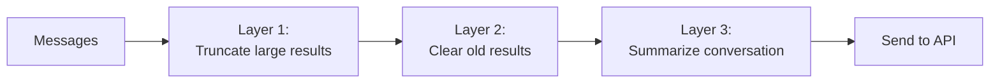

# Chapter 6: Context Compression

## The problem

A 50-turn conversation with an AI coding agent can easily reach 200,000 tokens. Every file read dumps thousands of tokens into the history. Every tool result stays there forever. And every API call sends the entire history.

At some point, you hit the context window limit and the API call fails. Before that, you are paying for all those old tokens on every single call.

You need a way to shrink the conversation without losing the important parts.

## The compression pipeline

Production agents do not use a single compression strategy. They use layers, from cheapest to most expensive:



Each layer runs before every API call. Cheap layers run first and handle most cases. Expensive layers only fire when the cheap ones are not enough.

## Layer 1: Truncate large tool results

The cheapest compression. Some tool results are huge. Reading a 5,000-line file dumps all of it into the conversation. But the model usually only needs the first part (for understanding the structure) or a specific section (for making an edit).

The fix: cap tool results at a character limit. If a result exceeds the limit, keep the first chunk and add a note that it was truncated.

```typescript
const MAX_RESULT_CHARS = 10_000;

function truncateResult(result: string): string {
  if (result.length <= MAX_RESULT_CHARS) {
    return result;
  }
  const truncated = result.slice(0, MAX_RESULT_CHARS);
  return (
    truncated +
    `\n\n[Truncated: result was ${result.length} characters. ` +
    `Showing first ${MAX_RESULT_CHARS}.]`
  );
}
```

This runs on every tool result as it is created. It is free (no extra API calls) and catches the biggest offenders.

**When it fires:** Every turn, on every tool result.

**What it costs:** Nothing. Just string slicing.

## Layer 2: Clear old tool results

Tool results from 20 turns ago are rarely useful. The model read a file, used the information, and moved on. Keeping the full file contents in the conversation is waste.

The fix: replace old tool results with a short stub.

```typescript
const KEEP_RECENT = 6; // Keep the last N tool results intact

function clearOldResults(
  messages: Anthropic.MessageParam[]
): Anthropic.MessageParam[] {
  // Find all tool result messages and their positions
  const toolResultPositions: number[] = [];
  messages.forEach((msg, i) => {
    if (typeof msg.content !== "string" && Array.isArray(msg.content)) {
      const hasToolResult = msg.content.some(
        (block: any) => block.type === "tool_result"
      );
      if (hasToolResult) toolResultPositions.push(i);
    }
  });

  // Keep the most recent ones, clear the rest
  const toClear = toolResultPositions.slice(0, -KEEP_RECENT);

  return messages.map((msg, i) => {
    if (!toClear.includes(i)) return msg;

    // Replace tool result content with a stub
    const content = (msg.content as any[]).map((block: any) => {
      if (block.type === "tool_result") {
        return {
          ...block,
          content: "[Previous tool result cleared to save context]",
        };
      }
      return block;
    });

    return { ...msg, content };
  });
}
```

This is more aggressive than truncation. Old tool results are completely replaced. But the tool call itself (the `tool_use` block in the assistant message) stays intact. The model can still see what it did. It just cannot see the full result anymore.

**When it fires:** Every turn, before sending to the API.

**What it costs:** Nothing. Just message rewriting.

## Layer 3: Summarize the conversation (autocompact)

When the conversation is still too long after layers 1 and 2, you need the big gun: ask the model to summarize the conversation.

This works by making a separate API call with the current conversation and a prompt like "summarize what has happened so far." Then you replace all the old messages with that summary.

```typescript
const CONTEXT_WINDOW = 200_000; // Model's context limit in tokens
const COMPACT_THRESHOLD = 0.8;  // Compact when we hit 80% of the limit

async function autoCompact(
  messages: Anthropic.MessageParam[],
  tokenEstimate: number
): Promise<{
  messages: Anthropic.MessageParam[];
  wasCompacted: boolean;
}> {
  // Only compact if we are approaching the limit
  if (tokenEstimate < CONTEXT_WINDOW * COMPACT_THRESHOLD) {
    return { messages, wasCompacted: false };
  }

  console.log("  [compact] Context is large, summarizing conversation...");

  // Ask the model to summarize
  const summaryResponse = await client.messages.create({
    model: "claude-sonnet-4-20250514",
    max_tokens: 2048,
    system:
      "Summarize this conversation between a user and a coding assistant. " +
      "Preserve: file paths mentioned, code changes made, current task state, " +
      "and any decisions or preferences expressed. Be concise but complete.",
    messages: messages,
  });

  const summaryText = summaryResponse.content
    .filter((b): b is Anthropic.TextBlock => b.type === "text")
    .map((b) => b.text)
    .join("\n");

  // Replace old messages with the summary
  // Keep the most recent messages intact (they are likely still relevant)
  const keepRecent = 4;
  const recentMessages = messages.slice(-keepRecent);

  const compactedMessages: Anthropic.MessageParam[] = [
    {
      role: "user",
      content:
        `[Conversation summary]\n${summaryText}\n\n` +
        `[The conversation continues from here.]`,
    },
    {
      role: "assistant",
      content: "I understand the context. I will continue from where we left off.",
    },
    ...recentMessages,
  ];

  return { messages: compactedMessages, wasCompacted: true };
}
```

After compaction, the conversation looks like:

```
[user]:      "[Conversation summary] The user asked to build a login page.
              I read src/pages/LoginPage.tsx and src/auth/useAuth.ts.
              I edited LoginPage.tsx to add a form. The current task is..."
[assistant]: "I understand the context."
[user]:      (recent message 1)
[assistant]: (recent message 2)
[user]:      (most recent message)
```

The old messages are gone. Replaced by a summary that preserves the important facts: what files were touched, what changes were made, and what the current task is.

**When it fires:** Only when the token count exceeds the threshold (80% of context window).

**What it costs:** One extra API call for the summarization. This is the expensive option, which is why we use cheaper layers first.

## The compact boundary

After compaction, we need to know where the summary ends and the real conversation begins. This is the "compact boundary." Everything before the boundary is summarized history. Everything after is live conversation.

On the next compaction cycle, we only summarize messages after the previous boundary. This prevents re-summarizing the same content.

```typescript
// Simple version: track the index where compacted content ends
let compactBoundaryIndex = 0;

// After compaction:
compactBoundaryIndex = 2; // Summary message + "I understand" message

// Next time we need to compact, start from compactBoundaryIndex
const messagesToSummarize = messages.slice(compactBoundaryIndex);
```

## Putting it all together

The compression pipeline runs before every API call:

```typescript
async function compressMessages(
  messages: Anthropic.MessageParam[]
): Promise<Anthropic.MessageParam[]> {
  // Layer 1: Truncation already happened when results were created

  // Layer 2: Clear old tool results
  let compressed = clearOldResults(messages);

  // Layer 3: Autocompact if still too large
  const tokenEstimate = estimateTokens(compressed);
  const { messages: compacted } = await autoCompact(compressed, tokenEstimate);

  return compacted;
}

// In the agentic loop:
while (true) {
  const compressed = await compressMessages(conversationHistory);
  const response = await client.messages.create({
    // ...
    messages: compressed,
  });
  // ...
}
```

Notice that we compress a copy of the messages. The original `conversationHistory` stays intact. We only compress when preparing the API call. This way, if we need to re-compress differently later, we still have the full history.

In practice, production agents do modify the conversation in place after compaction. Once a summary replaces old messages, the originals are gone. This saves memory but means you cannot undo it.

## How much does each layer save?

| Layer | Tokens saved | Cost | When it fires |
|---|---|---|---|
| Truncate results | 10-50% per large result | Free | Every tool result |
| Clear old results | 30-60% of total context | Free | Every turn |
| Autocompact | 70-90% of total context | 1 extra API call | At 80% of limit |

Layer 1 prevents individual results from being too large. Layer 2 steadily shrinks the history as it grows. Layer 3 is the reset button when everything else is not enough.

## What is still missing

Our agent runs anything the model asks it to. `rm -rf /`? Sure. `git push --force`? Why not. In the next chapter, we add a permission system that asks the user before running dangerous operations.

## Running the example

```bash
npx tsx examples/06-with-compression.ts
```

Have a long conversation (10+ turns) and watch the `[context]` log. You will see the token count grow, then drop when compression kicks in. Try reading several large files to trigger the threshold faster.
