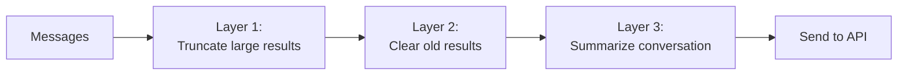

# Chapter 6: Context Compression

## The problem

A 50-turn conversation with an AI coding agent can easily reach 200,000 tokens. Every file read dumps thousands of tokens into the history. Every tool result stays there forever. And every API call sends the entire history.

At some point, you hit the context window limit and the API call fails. Before that, you are paying for all those old tokens on every single call.

You need a way to shrink the conversation without losing the important parts.

## The compression pipeline

Production agents do not use a single compression strategy. They use layers, from cheapest to most expensive:



Each layer runs before every API call. They are ordered by cost:

- **Cheap** means it just manipulates strings in memory. No API calls, no extra tokens, runs in milliseconds. Truncating a string or replacing old text with "[cleared]" is cheap.
- **Expensive** means it makes an additional API call to the LLM, which costs tokens and takes seconds. Asking the model to summarize the conversation is expensive.

Cheap layers run first and handle most cases. Expensive layers only fire when the cheap ones are not enough.

## Layer 1: Truncate large tool results

The cheapest compression. Some tool results are huge. Reading a 5,000-line file dumps all of it into the conversation. But the model usually only needs the first part (for understanding the structure) or a specific section (for making an edit).

The fix: cap tool results at a character limit. If a result exceeds the limit, keep the first chunk and add a note that it was truncated.

```typescript
const MAX_RESULT_CHARS = 10_000;

function truncateResult(result: string): string {
  if (result.length <= MAX_RESULT_CHARS) {
    return result;
  }
  const truncated = result.slice(0, MAX_RESULT_CHARS);
  return (
    truncated +
    `\n\n[Truncated: result was ${result.length} characters. ` +
    `Showing first ${MAX_RESULT_CHARS}.]`
  );
}
```

You call this in the agentic loop, right where tool results are collected before pushing them into the conversation:

```typescript
// In the agentic loop, after executing a tool:
const result = await tool.call(parsed.data);
const truncatedResult = truncateResult(result);  // <-- apply before storing

toolResults.push({
  type: "tool_result",
  tool_use_id: toolUse.id,
  content: truncatedResult,
});
```

Here is what this looks like in practice. The model reads a large file:

```
Before truncation (25,000 characters):

  1   import express from "express";
  2   import cors from "cors";
  3   ...
  ... (500 more lines)
  502 export default app;

After truncation (10,000 characters):

  1   import express from "express";
  2   import cors from "cors";
  3   ...
  ... (first ~200 lines)

  [Truncated: result was 25,000 characters. Showing first 10,000.]
```

The model sees enough of the file to understand its structure (imports, exports, main patterns) without the full 500 lines eating up context. If it needs a specific section later, it can read the file again with an offset.

**When it fires:** Every turn, on every tool result.

**What it costs:** Nothing. Just string slicing.

## Layer 2: Clear old tool results

Tool results from 20 turns ago are rarely useful. The model read a file, used the information, and moved on. Keeping the full file contents in the conversation is waste.

The fix: replace old tool results with a short stub.

```typescript
const KEEP_RECENT = 6; // Keep the last N tool results intact

function clearOldResults(
  messages: Anthropic.MessageParam[]
): Anthropic.MessageParam[] {
  // Find all tool result messages and their positions
  const toolResultPositions: number[] = [];
  messages.forEach((msg, i) => {
    if (typeof msg.content !== "string" && Array.isArray(msg.content)) {
      const hasToolResult = msg.content.some(
        (block: any) => block.type === "tool_result"
      );
      if (hasToolResult) toolResultPositions.push(i);
    }
  });

  // Keep the most recent ones, clear the rest
  const toClear = toolResultPositions.slice(0, -KEEP_RECENT);

  return messages.map((msg, i) => {
    if (!toClear.includes(i)) return msg;

    // Replace tool result content with a stub
    const content = (msg.content as any[]).map((block: any) => {
      if (block.type === "tool_result") {
        return {
          ...block,
          content: "[Previous tool result cleared to save context]",
        };
      }
      return block;
    });

    return { ...msg, content };
  });
}
```

Here is what this looks like. Say the conversation has 10 tool results and we keep the last 6:

```
Before clearing (10 tool results, keeping last 6):

  list_files    → "src/App.tsx\nsrc/Button..."       (500 chars)    ← CLEAR
  read_file     → "1  import React from...'         (20,000 chars)  ← CLEAR
  read_file     → "1  export function Button..."    (5,000 chars)   ← CLEAR
  search_files  → "src/App.tsx:3: import..."        (2,000 chars)   ← CLEAR
  edit_file     → "Edited src/App.tsx"              (20 chars)      ← keep
  read_file     → "1  import express from..."       (12,000 chars)  ← keep
  search_files  → "src/routes.ts:12: app.get..."    (1,500 chars)   ← keep
  read_file     → "1  const router = ..."           (8,000 chars)   ← keep
  edit_file     → "Edited src/routes.ts"            (22 chars)      ← keep
  run_command   → "Tests passed"                    (15 chars)      ← keep

After clearing:

  list_files    → "[Cleared]"                                       ← was 500
  read_file     → "[Cleared]"                                       ← was 20,000
  read_file     → "[Cleared]"                                       ← was 5,000
  search_files  → "[Cleared]"                                       ← was 2,000
  edit_file     → "Edited src/App.tsx"              (unchanged)
  read_file     → "1  import express from..."       (unchanged)
  ... (rest unchanged)

  Freed: ~27,500 characters from 4 old results
```

The old file contents (27,500 characters) are gone. But the tool calls in the assistant messages still say "I called read_file on src/App.tsx." The model can see *what* it did, just not the full result. If it needs that file again, it can re-read it.

This is more aggressive than truncation. Old tool results are completely replaced.

**When it fires:** Every turn, before sending to the API.

**What it costs:** Nothing. Just message rewriting.

## Layer 3: Summarize the conversation (autocompact)

When the conversation is still too long after layers 1 and 2, you need the big gun: ask the model to summarize the conversation.

This works by making a separate API call with the current conversation and a prompt like "summarize what has happened so far." Then you replace all the old messages with that summary.

```typescript
const CONTEXT_WINDOW = 200_000; // Model's context limit in tokens
const COMPACT_THRESHOLD = 0.8;  // Compact when we hit 80% of the limit

async function autoCompact(
  messages: Anthropic.MessageParam[],
  tokenEstimate: number
): Promise<{
  messages: Anthropic.MessageParam[];
  wasCompacted: boolean;
}> {
  // Only compact if we are approaching the limit
  if (tokenEstimate < CONTEXT_WINDOW * COMPACT_THRESHOLD) {
    return { messages, wasCompacted: false };
  }

  console.log("  [compact] Context is large, summarizing conversation...");

  // Ask the model to summarize
  const summaryResponse = await client.messages.create({
    model: "claude-sonnet-4-20250514",
    max_tokens: 2048,
    system:
      "Summarize this conversation between a user and a coding assistant. " +
      "Write in third person (say 'the user asked' and 'the assistant edited', not 'I'). " +
      "Preserve: file paths mentioned, code changes made, current task state, " +
      "and any decisions or preferences expressed. Be concise but complete.",
    messages: messages,
  });

  const summaryText = summaryResponse.content
    .filter((b): b is Anthropic.TextBlock => b.type === "text")
    .map((b) => b.text)
    .join("\n");

  // Replace old messages with the summary
  // Keep the most recent messages intact (they are likely still relevant)
  const keepRecent = 4;
  const recentMessages = messages.slice(-keepRecent);

  const compactedMessages: Anthropic.MessageParam[] = [
    {
      role: "user",
      content:
        `[Conversation summary]\n${summaryText}\n\n` +
        `[The conversation continues from here.]`,
    },
    {
      role: "assistant",
      content: "I understand the context. I will continue from where we left off.",
    },
    ...recentMessages,
  ];

  return { messages: compactedMessages, wasCompacted: true };
}
```

After compaction, the conversation looks like:

```
[user]:      "[Conversation summary]
              The user asked to build a login page. The assistant read
              src/pages/LoginPage.tsx and src/auth/useAuth.ts, then edited
              LoginPage.tsx to add a form. The current task is adding
              validation to the form fields."
[assistant]: "I understand the context. I will continue from where we left off."
[user]:      (recent message 1)
[assistant]: (recent message 2)
[user]:      (most recent message)
```

Why is the summary a `user` message? Because the API requires conversations to start with a `user` message. After compaction, the summary is the first message, so it has to be `role: "user"`. That is why we write it in third person ("the user asked", "the assistant read") instead of first person. It is a neutral recap, not someone talking.

The old messages are gone. Replaced by a summary that preserves the important facts: what files were touched, what changes were made, and what the current task is.

**When it fires:** Only when the token count exceeds the threshold (80% of context window).

**What it costs:** One extra API call for the summarization. This is the expensive option, which is why we use cheaper layers first.

## The compact boundary

After compaction, the messages array has a summary at the front and recent messages at the back. But the conversation keeps going. New messages pile up. Eventually you need to compact again.

The question is: which messages do you summarize the second time? You do not want to re-summarize the summary. That would lose information with each cycle (a summary of a summary of a summary gets worse every time).

The "compact boundary" is a marker that says "everything before this point is already summarized." When it is time to compact again, you only summarize messages after the boundary.

Here is what the messages array looks like over time:

```
After first compaction:
┌──────────────────────────────────────────────────┐
│ [summary of turns 1-20]          ← boundary here │
│ [assistant] "I understand."                      │
│ [user] "Now add a delete button"                 │
│ [assistant] [tool] read_file(...)                │
│ [tool_result] (file contents)                    │
│ [assistant] [tool] edit_file(...)                │
│ [tool_result] "Edited"                           │
│ ... 15 more turns ...                            │
└──────────────────────────────────────────────────┘

After second compaction:
┌──────────────────────────────────────────────────┐
│ [summary of turns 1-20]                          │
│ [summary of turns 21-35]         ← boundary here │
│ [assistant] "I understand."                      │
│ [user] "One more thing..."                       │
│ ... recent turns ...                             │
└──────────────────────────────────────────────────┘
```

The first summary stays untouched. The second compaction only summarized the new turns (21-35). This way, information degrades gracefully instead of collapsing into a single increasingly lossy summary.

In code:

```typescript
// Track where the last compaction ended
let compactBoundaryIndex = 0;

// After compaction:
compactBoundaryIndex = 2; // Summary + "I understand" message

// Next time we compact, only summarize messages after the boundary
const messagesToSummarize = messages.slice(compactBoundaryIndex);
```

## Putting it all together

The compression pipeline runs before every API call:

```typescript
async function compressMessages(
  messages: Anthropic.MessageParam[]
): Promise<Anthropic.MessageParam[]> {
  // Layer 1: Truncation already happened when results were created

  // Layer 2: Clear old tool results
  let compressed = clearOldResults(messages);

  // Layer 3: Autocompact if still too large
  const tokenEstimate = estimateTokens(compressed);
  const { messages: compacted } = await autoCompact(compressed, tokenEstimate);

  return compacted;
}

// In the agentic loop:
while (true) {
  const compressed = await compressMessages(conversationHistory);
  const response = await client.messages.create({
    // ...
    messages: compressed,
  });
  // ...
}
```

Notice that we compress a copy of the messages. The original `conversationHistory` stays intact. We only compress when preparing the API call. This way, if we need to re-compress differently later, we still have the full history.

In practice, production agents do modify the conversation in place after compaction. Once a summary replaces old messages, the originals are gone. This saves memory but means you cannot undo it.

## How much does each layer save?

| Layer | Tokens saved | Cost | When it fires |
|---|---|---|---|
| Truncate results | 10-50% per large result | Free | Every tool result |
| Clear old results | 30-60% of total context | Free | Every turn |
| Autocompact | 70-90% of total context | 1 extra API call | At 80% of limit |

Layer 1 prevents individual results from being too large. Layer 2 steadily shrinks the history as it grows. Layer 3 is the reset button when everything else is not enough.

These three layers cover the core concepts. Production agents often have more. For example, they might drop middle turns entirely while keeping the first and last few (snipping), or collapse groups of related messages into summaries without re-summarizing the whole conversation. But truncation, clearing, and summarization are the foundation that everything else builds on.

## What is still missing

Our agent runs anything the model asks it to. `rm -rf /`? Sure. `git push --force`? Why not. In the next chapter, we add a permission system that asks the user before running dangerous operations.

## Running the example

```bash
npm run example:06
```

**Heads up:** This example has a low compact threshold (8,000 tokens) for demo purposes. A longer conversation with bigger files will trigger all three layers. But even short conversations cost more than earlier examples because of context re-sending. Expect to spend $0.20-0.50 if you have a long session.

Watch the `[context]` log as you chat. You will see token counts go up as you read files, then drop when Layer 2 (clearing) kicks in. That drop is old tool results being replaced with "[Cleared]".

To trigger Layer 3 (the `[compact] Summarizing conversation...` log), you need the token count to exceed 8,000. With the small sample project, this takes many turns. Try asking the agent to read the example files in `examples/` instead, since those are much larger.

If you only see token counts going down without the `[compact]` log, that is Layer 2 working silently. Layer 3 only fires when Layer 2 is not enough.

## The full code

Here is everything from this chapter in one file (`examples/06-with-compression.ts`):

```typescript
import Anthropic from "@anthropic-ai/sdk";
import { z } from "zod";
import * as fs from "fs";
import * as path from "path";
import { execSync } from "child_process";
import * as readline from "readline";

const client = new Anthropic();

const SYSTEM_PROMPT = `You are a coding assistant. Use list_files and search_files to find files before editing. Always read a file before editing it. Be concise.`;

// --- Tool interface ---
interface Tool {
  name: string;
  description: string;
  inputSchema: z.ZodObject<any>;
  call(input: Record<string, unknown>): Promise<string>;
}

const readTimestamps = new Map<string, number>();

function findActualString(fileContent: string, searchString: string): string | null {
  if (fileContent.includes(searchString)) return searchString;
  const normalize = (s: string) => s.replace(/[\u2018\u2019]/g, "'").replace(/[\u201C\u201D]/g, '"');
  const index = normalize(fileContent).indexOf(normalize(searchString));
  if (index !== -1) return fileContent.substring(index, index + searchString.length);
  return null;
}

// --- Tools ---
const MAX_RESULT_CHARS = 10_000; // Layer 1: cap individual tool results

function truncateResult(result: string): string {
  if (result.length <= MAX_RESULT_CHARS) return result;
  return result.slice(0, MAX_RESULT_CHARS) +
    `\n\n[Truncated: was ${result.length} chars, showing first ${MAX_RESULT_CHARS}]`;
}

const readFileTool: Tool = {
  name: "read_file",
  description: "Read a file with line numbers. Always read before editing.",
  inputSchema: z.object({ file_path: z.string() }),
  async call(input) {
    const filePath = input.file_path as string;
    try {
      const content = fs.readFileSync(filePath, "utf-8");
      readTimestamps.set(path.resolve(filePath), Date.now());
      const numbered = content.split("\n").map((line, i) => `${i + 1}\t${line}`).join("\n");
      return truncateResult(numbered);
    } catch (err: any) {
      return `Error: ${err.message}`;
    }
  },
};

const editFileTool: Tool = {
  name: "edit_file",
  description: "Edit a file by replacing old_string with new_string. Must be unique match. Read first.",
  inputSchema: z.object({
    file_path: z.string(), old_string: z.string(),
    new_string: z.string(), replace_all: z.boolean().optional(),
  }),
  async call(input) {
    const { file_path, old_string, new_string, replace_all } = input as any;
    if (old_string === new_string) return "Error: strings are identical.";
    if (!fs.existsSync(file_path)) return `Error: not found: ${file_path}`;
    const content = fs.readFileSync(file_path, "utf-8");
    const actual = findActualString(content, old_string);
    if (!actual) return "Error: old_string not found.";
    if (!replace_all && content.split(actual).length - 1 > 1)
      return "Error: multiple matches. Add more context or set replace_all.";
    const resolved = path.resolve(file_path);
    const lastRead = readTimestamps.get(resolved);
    if (lastRead) { try { if (fs.statSync(file_path).mtimeMs > lastRead) return "Error: file modified since last read."; } catch {} }
    const updated = replace_all ? content.split(actual).join(new_string) : content.replace(actual, new_string);
    fs.writeFileSync(file_path, updated);
    readTimestamps.set(resolved, Date.now());
    return `Edited ${file_path}`;
  },
};

const writeFileTool: Tool = {
  name: "write_file",
  description: "Create or overwrite a file.",
  inputSchema: z.object({ file_path: z.string(), content: z.string() }),
  async call(input) {
    const filePath = input.file_path as string;
    fs.mkdirSync(path.dirname(filePath), { recursive: true });
    fs.writeFileSync(filePath, input.content as string);
    return `Written: ${filePath}`;
  },
};

const listFilesTool: Tool = {
  name: "list_files",
  description: "List files recursively.",
  inputSchema: z.object({ directory: z.string().optional() }),
  async call(input) {
    const dir = (input.directory as string) || ".";
    const files: string[] = [];
    function walk(d: string) {
      try {
        for (const entry of fs.readdirSync(d, { withFileTypes: true })) {
          if (entry.name.startsWith(".") || entry.name === "node_modules") continue;
          const full = path.join(d, entry.name);
          if (entry.isDirectory()) walk(full); else files.push(full);
        }
      } catch {}
    }
    walk(dir);
    return files.join("\n") || "(empty)";
  },
};

const searchFilesTool: Tool = {
  name: "search_files",
  description: "Search for a regex pattern in files.",
  inputSchema: z.object({ pattern: z.string(), directory: z.string().optional() }),
  async call(input) {
    const dir = (input.directory as string) || ".";
    const regex = new RegExp(input.pattern as string);
    const results: string[] = [];
    function search(d: string) {
      try {
        for (const entry of fs.readdirSync(d, { withFileTypes: true })) {
          if (entry.name.startsWith(".") || entry.name === "node_modules") continue;
          const full = path.join(d, entry.name);
          if (entry.isDirectory()) { search(full); } else {
            try { fs.readFileSync(full, "utf-8").split("\n").forEach((line, i) => {
              if (regex.test(line)) results.push(`${full}:${i + 1}: ${line.trim()}`);
            }); } catch {}
          }
        }
      } catch {}
    }
    search(dir);
    return truncateResult(results.slice(0, 50).join("\n") || "No matches.");
  },
};

const runCommandTool: Tool = {
  name: "run_command",
  description: "Run a shell command.",
  inputSchema: z.object({ command: z.string() }),
  async call(input) {
    try {
      const output = execSync(input.command as string, { encoding: "utf-8", timeout: 30_000, maxBuffer: 1024 * 1024 });
      return truncateResult(output || "(no output)");
    } catch (err: any) {
      return `Error: ${err.stderr || err.message}`;
    }
  },
};

const tools: Tool[] = [readFileTool, editFileTool, writeFileTool, listFilesTool, searchFilesTool, runCommandTool];

function zodToJsonSchema(schema: z.ZodObject<any>): Record<string, unknown> {
  const shape = schema.shape;
  const properties: Record<string, unknown> = {};
  const required: string[] = [];
  for (const [key, value] of Object.entries(shape)) {
    const zodValue = value as z.ZodTypeAny;
    const isOptional = zodValue.isOptional();
    const innerType = isOptional ? (zodValue as z.ZodOptional<any>)._def.innerType : zodValue;
    const isBoolean = innerType instanceof z.ZodBoolean;
    properties[key] = { type: isBoolean ? "boolean" : "string", description: innerType._def.description || "" };
    if (!isOptional) required.push(key);
  }
  return { type: "object", properties, required };
}

// --- Token estimation ---
function estimateTokens(messages: Anthropic.MessageParam[]): number {
  let chars = 0;
  for (const msg of messages) {
    if (typeof msg.content === "string") { chars += msg.content.length; }
    else if (Array.isArray(msg.content)) {
      for (const block of msg.content) {
        if ("text" in block && typeof block.text === "string") chars += block.text.length;
        else if ("content" in block && typeof block.content === "string") chars += block.content.length;
        else if ("input" in block) chars += JSON.stringify(block.input).length;
      }
    }
  }
  return Math.ceil(chars / 4);
}

// --- Layer 2: Clear old tool results ---
const KEEP_RECENT_RESULTS = 6;

function clearOldResults(messages: Anthropic.MessageParam[]): Anthropic.MessageParam[] {
  const toolResultIndices: number[] = [];
  messages.forEach((msg, i) => {
    if (typeof msg.content !== "string" && Array.isArray(msg.content)) {
      if (msg.content.some((b: any) => b.type === "tool_result")) toolResultIndices.push(i);
    }
  });

  const toClear = new Set(toolResultIndices.slice(0, -KEEP_RECENT_RESULTS));

  return messages.map((msg, i) => {
    if (!toClear.has(i)) return msg;
    const content = (msg.content as any[]).map((block: any) => {
      if (block.type === "tool_result") {
        return { ...block, content: "[Cleared to save context]" };
      }
      return block;
    });
    return { ...msg, content };
  });
}

// --- Layer 3: Autocompact (LLM summarization) ---
// Using a low threshold for demo purposes so you can see it trigger.
// In production, this would be ~80% of the model's context window.
const COMPACT_THRESHOLD_TOKENS = 8_000; // Low for demo. Production: ~160,000

async function autoCompact(
  messages: Anthropic.MessageParam[],
  tokenEstimate: number
): Promise<{ messages: Anthropic.MessageParam[]; wasCompacted: boolean }> {
  if (tokenEstimate < COMPACT_THRESHOLD_TOKENS) {
    return { messages, wasCompacted: false };
  }

  console.log("  [compact] Summarizing conversation to free up context...");

  const summaryResponse = await client.messages.create({
    model: "claude-sonnet-4-20250514",
    max_tokens: 1024,
    system:
      "Summarize this conversation between a user and a coding assistant. " +
      "Preserve: file paths, code changes made, current task, and user preferences. " +
      "Be concise but do not lose important details.",
    messages,
  });

  const summaryText = summaryResponse.content
    .filter((b): b is Anthropic.TextBlock => b.type === "text")
    .map((b) => b.text)
    .join("\n");

  // Keep the last few messages intact
  const keepRecent = 4;
  const recentMessages = messages.slice(-keepRecent);

  const compacted: Anthropic.MessageParam[] = [
    {
      role: "user",
      content: `[Conversation summary]\n${summaryText}\n\n[Continuing from here.]`,
    },
    {
      role: "assistant",
      content: "Understood. I have the context from our previous conversation.",
    },
    ...recentMessages,
  ];

  const savedTokens = tokenEstimate - estimateTokens(compacted);
  console.log(`  [compact] Saved ~${savedTokens} tokens`);

  return { messages: compacted, wasCompacted: true };
}

// --- Full compression pipeline ---
async function compressMessages(
  messages: Anthropic.MessageParam[]
): Promise<Anthropic.MessageParam[]> {
  // Layer 1: Truncation already applied when results were created

  // Layer 2: Clear old tool results
  let compressed = clearOldResults(messages);

  // Layer 3: Autocompact if still too large
  const tokenEstimate = estimateTokens(compressed);
  const { messages: compacted, wasCompacted } = await autoCompact(compressed, tokenEstimate);

  return compacted;
}

// --- The agentic loop (with compression) ---
async function agentLoop(
  conversationHistory: Anthropic.MessageParam[]
): Promise<string> {
  let turns = 0;
  const maxTurns = 20;

  const apiTools: Anthropic.Tool[] = tools.map((tool) => ({
    name: tool.name,
    description: tool.description,
    input_schema: zodToJsonSchema(tool.inputSchema) as Anthropic.Tool["input_schema"],
  }));

  while (true) {
    turns++;
    if (turns > maxTurns) return "[max turns reached]";

    // Run the compression pipeline before each API call
    const compressed = await compressMessages(conversationHistory);
    const tokenEstimate = estimateTokens(compressed);
    console.log(`  [context] ~${tokenEstimate} tokens in ${compressed.length} messages`);

    const response = await client.messages.create({
      model: "claude-sonnet-4-20250514",
      max_tokens: 4096,
      system: SYSTEM_PROMPT,
      tools: apiTools,
      messages: compressed,
    });

    conversationHistory.push({ role: "assistant", content: response.content });

    const toolUseBlocks = response.content.filter(
      (block): block is Anthropic.ToolUseBlock => block.type === "tool_use"
    );

    if (toolUseBlocks.length === 0) {
      return response.content
        .filter((b): b is Anthropic.TextBlock => b.type === "text")
        .map((b) => b.text).join("\n");
    }

    const toolResults: Anthropic.ToolResultBlockParam[] = [];
    for (const toolUse of toolUseBlocks) {
      const tool = tools.find((t) => t.name === toolUse.name);
      if (!tool) {
        toolResults.push({ type: "tool_result", tool_use_id: toolUse.id, content: `Unknown: ${toolUse.name}`, is_error: true });
        continue;
      }
      const parsed = tool.inputSchema.safeParse(toolUse.input);
      if (!parsed.success) {
        toolResults.push({ type: "tool_result", tool_use_id: toolUse.id, content: `Invalid: ${parsed.error.message}`, is_error: true });
        continue;
      }

      console.log(`  [tool] ${toolUse.name}(${JSON.stringify(toolUse.input).slice(0, 100)})`);
      const result = await tool.call(parsed.data);
      console.log(`  [result] ${result.slice(0, 150)}${result.length > 150 ? "..." : ""}`);
      toolResults.push({ type: "tool_result", tool_use_id: toolUse.id, content: result });
    }

    conversationHistory.push({ role: "user", content: toolResults });
  }
}

// --- REPL ---
async function main() {
  const conversationHistory: Anthropic.MessageParam[] = [];
  const rl = readline.createInterface({ input: process.stdin, output: process.stdout });

  console.log("Agent with context compression. Watch [context] and [compact] logs.");
  console.log(`Compact threshold: ${COMPACT_THRESHOLD_TOKENS} tokens (low for demo).`);
  console.log("Read several files to trigger compression.\n");

  const ask = () => {
    rl.question("> ", async (input) => {
      const trimmed = input.trim();
      if (!trimmed) return ask();
      conversationHistory.push({ role: "user", content: trimmed });
      console.log("");
      const response = await agentLoop(conversationHistory);
      console.log(`\n${response}\n`);
      ask();
    });
  };
  ask();
}

main();

```
