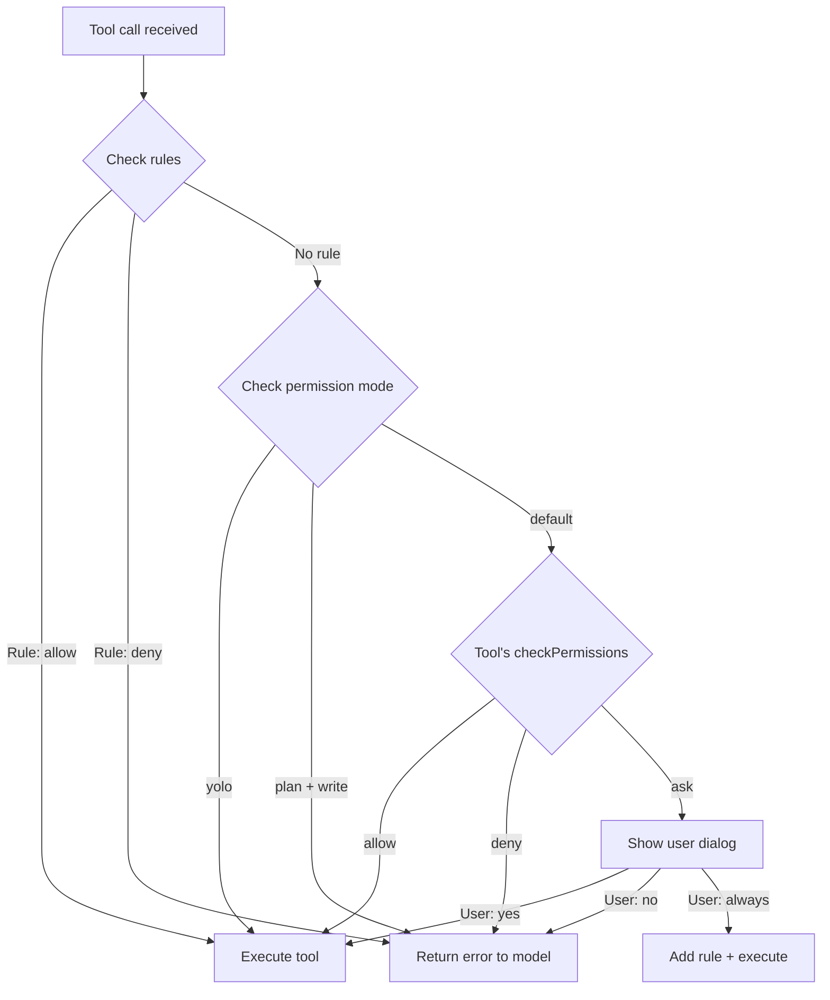

# Chapter 7: Permissions

## The problem

Our agent can run any shell command. `rm -rf /`. `git push --force origin main`. `curl` to some random server with your source code. The model will not do these things on purpose, but mistakes happen. And some tasks genuinely require dangerous operations.

You need a gate between "the model wants to do something" and "the thing actually happens."

## Walkthrough: Should this command run?

The model wants to run `npm install express`. Is that safe?

It depends. If the user asked to "add Express to the project," then yes. If the user asked to "read the README," then no, the model should not be installing packages on its own.

A permission system lets the user decide:

```
  [tool] run_command({ command: "npm install express" })

  The agent wants to run: npm install express
  Allow? [y]es / [n]o / [a]lways allow this pattern
  > y

  [result] added 1 package...
```

The user saw what was about to happen and approved it. If they had pressed "n", the model would get an error back and try a different approach.

## The three decisions

Every tool call results in one of three decisions:

| Decision | What happens |
|---|---|
| **allow** | The tool runs immediately. The user is not asked. |
| **ask** | The user sees the tool call and approves or denies it. |
| **deny** | The tool is rejected with an error message. The user is not asked. |

"Allow" is for safe operations like reading files. "Ask" is for things that could be dangerous. "Deny" is for things you never want to happen.

## Adding checkPermissions to tools

We extend the tool interface with a `checkPermissions` method:

```typescript
type PermissionDecision = "allow" | "ask" | "deny";

interface Tool {
  name: string;
  description: string;
  inputSchema: z.ZodObject<any>;
  call(input: Record<string, unknown>): Promise<string>;
  checkPermissions(input: Record<string, unknown>): PermissionDecision;
}
```

Each tool decides whether it needs permission:

```typescript
const readFileTool: Tool = {
  // ...
  checkPermissions() {
    return "allow"; // Reading is always safe
  },
};

const editFileTool: Tool = {
  // ...
  checkPermissions() {
    return "ask"; // Editing files needs approval
  },
};

const runCommandTool: Tool = {
  // ...
  checkPermissions(input) {
    const command = input.command as string;
    // Some commands are safe
    if (/^(ls|cat|echo|pwd|git status|git diff|git log)/.test(command)) {
      return "allow";
    }
    // Everything else needs approval
    return "ask";
  },
};
```

The run_command tool is the most interesting. Some commands are read-only (like `ls` or `git status`). Those are safe. Everything else gets an "ask."

## Permission modes

Different users want different levels of control. Some want to approve every single action. Some want the agent to just do its thing. Permission modes let the user choose:

```typescript
type PermissionMode = "default" | "plan" | "yolo";

// default: ask for writes and commands, allow reads
// plan:    read-only mode, deny all writes and commands
// yolo:    allow everything (dangerous, but useful for trusted tasks)
```

The mode overrides individual tool decisions:

```typescript
function getEffectiveDecision(
  toolDecision: PermissionDecision,
  mode: PermissionMode
): PermissionDecision {
  switch (mode) {
    case "yolo":
      return "allow"; // Override everything to allow
    case "plan":
      // Only allow read-only operations
      if (toolDecision === "allow") return "allow";
      return "deny";
    case "default":
      return toolDecision; // Use the tool's own decision
  }
}
```

## Permission rules

Beyond modes, you can add specific rules. "Always allow `npm test`." "Never allow `rm`." Rules override the default behavior for specific patterns.

```typescript
interface PermissionRule {
  toolName: string;
  pattern?: string; // Regex pattern for the input
  decision: "allow" | "deny";
}

const rules: PermissionRule[] = [
  { toolName: "run_command", pattern: "^npm test", decision: "allow" },
  { toolName: "run_command", pattern: "^rm ", decision: "deny" },
];

function checkRules(
  toolName: string,
  input: Record<string, unknown>
): PermissionDecision | null {
  const inputStr = JSON.stringify(input);
  for (const rule of rules) {
    if (rule.toolName !== toolName) continue;
    if (rule.pattern && !new RegExp(rule.pattern).test(inputStr)) continue;
    return rule.decision;
  }
  return null; // No matching rule
}
```

Rules are checked before the tool's own `checkPermissions`. If a rule matches, it takes priority.

## The permission dialog

When the decision is "ask," we show the user what the agent wants to do:

```typescript
async function askUserPermission(
  toolName: string,
  input: Record<string, unknown>,
  rl: readline.Interface
): Promise<boolean> {
  const inputStr = JSON.stringify(input, null, 2);
  console.log(`\n  The agent wants to use: ${toolName}`);
  console.log(`  Input: ${inputStr}`);

  return new Promise((resolve) => {
    rl.question(
      "  Allow? [y]es / [n]o / [a]lways allow this tool > ",
      (answer) => {
        const choice = answer.trim().toLowerCase();
        if (choice === "a" || choice === "always") {
          // Add a session rule to always allow this tool
          rules.push({ toolName, decision: "allow" });
          console.log(`  Added rule: always allow ${toolName}`);
          resolve(true);
        }
        resolve(choice === "y" || choice === "yes");
      }
    );
  });
}
```

The "always" option adds a session rule so the user does not get asked again for the same tool. This is convenient for repetitive operations. In our example, the rule lasts for the current session only (stored in memory).

Production agents take this further. They let users save rules to different places:

- **Session** - in memory, gone when the session ends
- **Project settings** - saved to a file in the project (e.g., `.claude/settings.json`), shared with the team
- **User settings** - saved to a global config file (e.g., `~/.claude/settings.json`), applies to all projects

This way, a user can say "always allow `npm test` in this project" and it persists across sessions.

## The permission check flow



## Wiring it into the loop

The permission check goes between "model requests tool" and "tool executes":

```typescript
// In the agentic loop, when executing tools:
for (const toolUse of toolUseBlocks) {
  const tool = tools.find((t) => t.name === toolUse.name);
  if (!tool) { /* handle unknown tool */ continue; }

  // Permission check (new!)
  const ruleDecision = checkRules(tool.name, toolUse.input);
  const toolDecision = ruleDecision ?? tool.checkPermissions(toolUse.input);
  const finalDecision = getEffectiveDecision(toolDecision, permissionMode);

  if (finalDecision === "deny") {
    toolResults.push({
      type: "tool_result",
      tool_use_id: toolUse.id,
      content: "Permission denied. This operation is not allowed.",
      is_error: true,
    });
    continue;
  }

  if (finalDecision === "ask") {
    const allowed = await askUserPermission(tool.name, toolUse.input, rl);
    if (!allowed) {
      toolResults.push({
        type: "tool_result",
        tool_use_id: toolUse.id,
        content: "Permission denied by user.",
        is_error: true,
      });
      continue;
    }
  }

  // Execute the tool (same as before)
  const result = await tool.call(parsed.data);
  // ...
}
```

When a tool is denied, the model gets an error back. It does not crash. The model sees "Permission denied" and can adjust. Maybe it asks the user for help. Maybe it tries a different approach. The loop continues.

## What is still missing

Our agent runs everything in one big conversation. Complex tasks sometimes benefit from splitting the work. "Explore the codebase" is a separate concern from "make the edit." In the next chapter, we will build subagents that can do isolated work and report back.

## Running the example

```bash
npm run example:07
```

Try:
- "Read the Button component" (should auto-allow, no prompt)
- "Run npm --version" (should ask for permission)
- "Delete all files" (the model may try `rm`, which should trigger a permission prompt)
