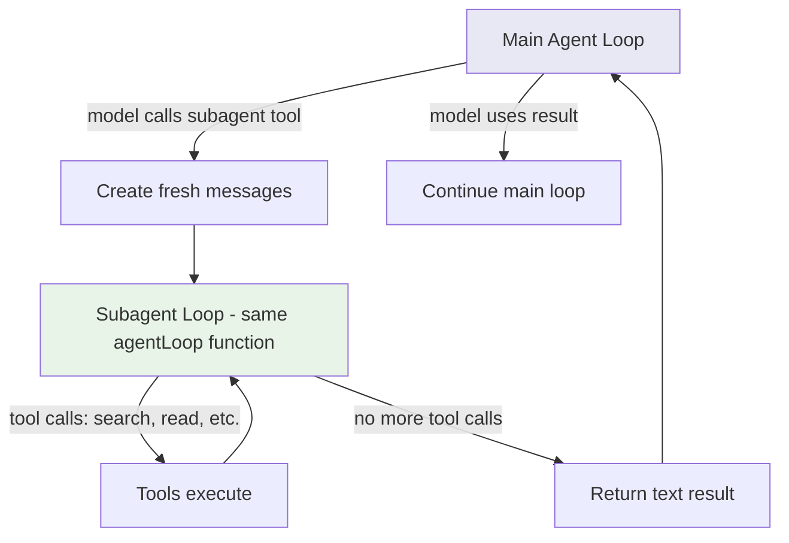

# Chapter 8: Subagents

## The problem

You ask the agent: "Update the API, then update the tests, then update the docs."

The agent reads 10 API files, 15 test files, and 8 doc files. All those file contents are now in the conversation history. By the time it gets to the docs, the context is full of API code that is no longer relevant.

Complex tasks have subtasks that do not need each other's context. The API exploration should not pollute the test-writing context. The test-writing should not pollute the doc-writing context.

## What is a subagent?

A subagent is just another instance of the same agentic loop running with its own conversation history. The main agent spawns it by calling a tool (like any other tool), gives it a prompt, and gets back a text result when it is done.

The key idea: the subagent has its own messages array. Its tool calls and results stay in its own context, not the parent's. The parent only sees the final summary the subagent returns.

It is not a separate program or process. It is the same `agentLoop()` function called with a fresh messages array.

## Walkthrough: Delegating a search task

The main agent gets: "Find all the components that use the Button component and tell me about them."

Instead of doing the search itself (which would dump results into its own context), it delegates:

```
Main agent:
  [tool] subagent({
    prompt: "Search for all files that import Button. Read each one and
             summarize what it does with the Button component."
  })

  Subagent (its own loop):
    [tool] search_files({ pattern: "import.*Button", directory: "src" })
    [tool] read_file("src/pages/Home.tsx")
    [tool] read_file("src/pages/Settings.tsx")
    [tool] read_file("src/pages/Profile.tsx")
    Returns: "Found 3 components: Home uses Button for navigation,
             Settings uses it for form submission, Profile uses it
             for the edit action."

Main agent receives: "Found 3 components: Home uses Button for..."
```

The main agent's context stays clean. It only sees the summary, not the 3 full files the subagent read. The subagent did all the heavy reading in its own isolated context.

## Same function, isolated context

A subagent is not a separate program. It is the same agentic loop we built in Chapter 1, called with a fresh messages array:

```typescript
async function runSubagent(prompt: string): Promise<string> {
  // Fresh conversation, just the prompt
  const subagentMessages: Anthropic.MessageParam[] = [
    { role: "user", content: prompt },
  ];

  // Run the same agentic loop with isolated messages
  return agentLoop(subagentMessages);
}
```

That is the core idea. The subagent calls the same `agentLoop()` function. It has access to the same tools (read, edit, search, etc.). But it has its own conversation history. Its tool results do not leak into the parent's context.

## Shared vs isolated

Not everything is isolated. Some things need to be shared:

| Component | Shared or Isolated | Why |
|---|---|---|
| **Messages** | Isolated | The whole point. Keep contexts separate. |
| **File read cache** | Cloned | The subagent gets a copy of what the parent has read so far (for staleness checks). New reads by the subagent do not flow back to the parent. |
| **Tools** | Shared | Both use the same tools. |
| **Abort signal** | Linked | If the user cancels, both parent and child should stop. |
| **Permission rules** | Shared | If the user said "always allow edit_file," that applies to subagents too. |

Here is how we set it up:

```typescript
async function runSubagent(
  prompt: string,
  parentAbortSignal?: AbortSignal
): Promise<string> {
  // Create a child abort controller linked to the parent
  const childAbort = new AbortController();
  if (parentAbortSignal) {
    parentAbortSignal.addEventListener("abort", () => childAbort.abort());
  }

  // Fresh messages, but shared everything else
  const subagentMessages: Anthropic.MessageParam[] = [
    { role: "user", content: prompt },
  ];

  return agentLoop(subagentMessages);
}
```

The messages are fresh. The abort signal is linked (parent cancel kills the child too). Everything else (tools, permissions, file state) is shared because it lives in module scope.

## The subagent tool

The subagent is itself a tool that the model can call:

```typescript
const subagentTool: Tool = {
  name: "subagent",
  description:
    "Delegate a task to a subagent. The subagent runs in its own context " +
    "and returns a summary. Use this for exploration, research, or " +
    "subtasks that would clutter your main context.",
  inputSchema: z.object({
    prompt: z.string().describe("The task for the subagent to perform"),
  }),
  checkPermissions() {
    return "allow"; // Subagents use the same permission rules
  },
  async call(input) {
    const prompt = input.prompt as string;
    console.log("  [subagent] Starting...");
    const result = await runSubagent(prompt);
    console.log("  [subagent] Done.");
    return result;
  },
};
```

The model decides when to use a subagent. It is just another tool in its toolbox. For big, exploratory tasks, it delegates. For simple, focused tasks, it acts directly.

## How it looks in practice



The parent and child both run `agentLoop()`. The child's tool calls and results stay in its own context. The parent only sees the final text the child returns.

## When to use subagents

Subagents are useful for:

- **Exploration**: "Find all files related to authentication" without dumping 20 file reads into the main context
- **Multi-part tasks**: "Update the API" and "Update the tests" as separate subagent calls
- **Background research**: Looking up patterns, reading documentation files, understanding code structure
- **Risky experiments**: If the subagent's approach fails, the main context is not polluted with failed attempts

Subagents are NOT useful for:

- **Simple tasks**: Reading one file and making one edit. The overhead of a subagent is not worth it.
- **Tasks that need parent context**: If the subagent needs to know what the parent already discussed, you would have to pass that context anyway, defeating the purpose.

## Max turns

Subagents should have a tighter turn limit than the main agent. A runaway subagent can burn tokens fast. Set a max of 10-15 turns for subagents versus 20-30 for the main agent:

```typescript
async function runSubagent(prompt: string): Promise<string> {
  const messages: Anthropic.MessageParam[] = [
    { role: "user", content: prompt },
  ];
  return agentLoop(messages, { maxTurns: 10 });
}
```

## What is still missing

Our agent works, but the user experience is rough. When the model thinks, the user stares at a blank screen. When it is reading a large file, nothing happens for seconds. In the next chapter, we will add streaming so the user sees responses as they are generated, token by token.

## Running the example

```bash
npm run example:08
```

Try:
- "Use a subagent to find all components in sample-project and describe each one"
- "What does each file in sample-project do?" (the model might delegate the exploration)

## The full code

Here is everything from this chapter in one file (`examples/08-with-subagents.ts`):

```typescript
// This example focuses on: subagents (Chapter 8).
// Includes: tools (Ch2), edit (Ch3), system prompt (Ch4), context (Ch5), compression (Ch6).
// Omits: permissions (Ch7) to keep the code focused on the subagent concept.

import Anthropic from "@anthropic-ai/sdk";
import { z } from "zod";
import * as fs from "fs";
import * as path from "path";
import { execSync } from "child_process";
import * as readline from "readline";

const client = new Anthropic();

const SYSTEM_PROMPT = `You are a coding assistant. Use list_files and search_files to find files before editing. Always read before editing. Be concise.

You have a "subagent" tool. Use it to delegate exploration or research tasks that would produce a lot of output. The subagent works in its own context so its tool results do not clutter yours.`;

// --- Types ---
interface Tool {
  name: string;
  description: string;
  inputSchema: z.ZodObject<any>;
  call(input: Record<string, unknown>): Promise<string>;
}

const readTimestamps = new Map<string, number>();
const MAX_RESULT_CHARS = 10_000;

function truncateResult(result: string): string {
  if (result.length <= MAX_RESULT_CHARS) return result;
  return result.slice(0, MAX_RESULT_CHARS) + `\n[Truncated: ${result.length} chars]`;
}

function findActualString(fileContent: string, searchString: string): string | null {
  if (fileContent.includes(searchString)) return searchString;
  const normalize = (s: string) => s.replace(/[\u2018\u2019]/g, "'").replace(/[\u201C\u201D]/g, '"');
  const index = normalize(fileContent).indexOf(normalize(searchString));
  if (index !== -1) return fileContent.substring(index, index + searchString.length);
  return null;
}

function zodToJsonSchema(schema: z.ZodObject<any>): Record<string, unknown> {
  const shape = schema.shape;
  const properties: Record<string, unknown> = {};
  const required: string[] = [];
  for (const [key, value] of Object.entries(shape)) {
    const zodValue = value as z.ZodTypeAny;
    const isOptional = zodValue.isOptional();
    const innerType = isOptional ? (zodValue as z.ZodOptional<any>)._def.innerType : zodValue;
    const isBoolean = innerType instanceof z.ZodBoolean;
    properties[key] = { type: isBoolean ? "boolean" : "string", description: innerType._def.description || "" };
    if (!isOptional) required.push(key);
  }
  return { type: "object", properties, required };
}

// --- Tools (without subagent, which is added separately) ---

const baseTools: Tool[] = [
  {
    name: "read_file",
    description: "Read a file with line numbers.",
    inputSchema: z.object({ file_path: z.string() }),
    async call(input) {
      const filePath = input.file_path as string;
      try {
        const content = fs.readFileSync(filePath, "utf-8");
        readTimestamps.set(path.resolve(filePath), Date.now());
        return truncateResult(content.split("\n").map((l, i) => `${i + 1}\t${l}`).join("\n"));
      } catch (err: any) { return `Error: ${err.message}`; }
    },
  },
  {
    name: "edit_file",
    description: "Edit a file by replacing old_string with new_string. Read first.",
    inputSchema: z.object({ file_path: z.string(), old_string: z.string(), new_string: z.string(), replace_all: z.boolean().optional() }),
    async call(input) {
      const { file_path, old_string, new_string, replace_all } = input as any;
      if (old_string === new_string) return "Error: strings identical.";
      if (!fs.existsSync(file_path)) return `Error: not found: ${file_path}`;
      const content = fs.readFileSync(file_path, "utf-8");
      const actual = findActualString(content, old_string);
      if (!actual) return "Error: old_string not found.";
      if (!replace_all && content.split(actual).length - 1 > 1) return "Error: multiple matches.";
      const updated = replace_all ? content.split(actual).join(new_string) : content.replace(actual, new_string);
      fs.writeFileSync(file_path, updated);
      readTimestamps.set(path.resolve(file_path), Date.now());
      return `Edited ${file_path}`;
    },
  },
  {
    name: "write_file",
    description: "Create or overwrite a file.",
    inputSchema: z.object({ file_path: z.string(), content: z.string() }),
    async call(input) {
      const filePath = input.file_path as string;
      fs.mkdirSync(path.dirname(filePath), { recursive: true });
      fs.writeFileSync(filePath, input.content as string);
      return `Written: ${filePath}`;
    },
  },
  {
    name: "list_files",
    description: "List files recursively.",
    inputSchema: z.object({ directory: z.string().optional() }),
    async call(input) {
      const dir = (input.directory as string) || ".";
      const files: string[] = [];
      function walk(d: string) {
        try {
          for (const entry of fs.readdirSync(d, { withFileTypes: true })) {
            if (entry.name.startsWith(".") || entry.name === "node_modules") continue;
            const full = path.join(d, entry.name);
            if (entry.isDirectory()) walk(full); else files.push(full);
          }
        } catch {}
      }
      walk(dir);
      return files.join("\n") || "(empty)";
    },
  },
  {
    name: "search_files",
    description: "Search for a regex pattern in files.",
    inputSchema: z.object({ pattern: z.string(), directory: z.string().optional() }),
    async call(input) {
      const dir = (input.directory as string) || ".";
      const regex = new RegExp(input.pattern as string);
      const results: string[] = [];
      function search(d: string) {
        try {
          for (const entry of fs.readdirSync(d, { withFileTypes: true })) {
            if (entry.name.startsWith(".") || entry.name === "node_modules") continue;
            const full = path.join(d, entry.name);
            if (entry.isDirectory()) { search(full); } else {
              try { fs.readFileSync(full, "utf-8").split("\n").forEach((line, i) => {
                if (regex.test(line)) results.push(`${full}:${i + 1}: ${line.trim()}`);
              }); } catch {}
            }
          }
        } catch {}
      }
      search(dir);
      return truncateResult(results.slice(0, 50).join("\n") || "No matches.");
    },
  },
  {
    name: "run_command",
    description: "Run a shell command.",
    inputSchema: z.object({ command: z.string() }),
    async call(input) {
      try {
        return truncateResult(execSync(input.command as string, { encoding: "utf-8", timeout: 30_000, maxBuffer: 1024 * 1024 }) || "(no output)");
      } catch (err: any) { return `Error: ${err.stderr || err.message}`; }
    },
  },
];

// --- The agentic loop ---
async function agentLoop(
  messages: Anthropic.MessageParam[],
  options: { maxTurns?: number; depth?: number } = {}
): Promise<string> {
  const maxTurns = options.maxTurns ?? 20;
  const depth = options.depth ?? 0;
  const indent = "  ".repeat(depth);
  let turns = 0;

  // Subagent tool: calls agentLoop recursively with isolated messages.
  // Only available at the top level (subagents cannot spawn sub-subagents).
  const subagentTool: Tool = {
    name: "subagent",
    description:
      "Delegate a task to a subagent with its own isolated context. " +
      "Use for exploration or research that would produce lots of output. " +
      "The subagent returns a text summary.",
    inputSchema: z.object({
      prompt: z.string().describe("The task for the subagent"),
    }),
    async call(input) {
      console.log(`${indent}  [subagent] Starting...`);
      const subMessages: Anthropic.MessageParam[] = [
        { role: "user", content: input.prompt as string },
      ];
      const result = await agentLoop(subMessages, {
        maxTurns: 10,
        depth: depth + 1,
      });
      console.log(`${indent}  [subagent] Done (${result.length} chars)`);
      return result;
    },
  };

  // Top-level agents get the subagent tool. Subagents do not (no recursion).
  const allTools = depth === 0 ? [...baseTools, subagentTool] : baseTools;

  const apiTools: Anthropic.Tool[] = allTools.map((tool) => ({
    name: tool.name,
    description: tool.description,
    input_schema: zodToJsonSchema(tool.inputSchema) as Anthropic.Tool["input_schema"],
  }));

  while (true) {
    turns++;
    if (turns > maxTurns) return "[max turns reached]";

    const response = await client.messages.create({
      model: "claude-sonnet-4-20250514",
      max_tokens: 4096,
      system: SYSTEM_PROMPT,
      tools: apiTools,
      messages,
    });

    messages.push({ role: "assistant", content: response.content });

    const toolUseBlocks = response.content.filter(
      (block): block is Anthropic.ToolUseBlock => block.type === "tool_use"
    );

    if (toolUseBlocks.length === 0) {
      return response.content
        .filter((b): b is Anthropic.TextBlock => b.type === "text")
        .map((b) => b.text).join("\n");
    }

    const toolResults: Anthropic.ToolResultBlockParam[] = [];

    for (const toolUse of toolUseBlocks) {
      const tool = allTools.find((t) => t.name === toolUse.name);
      if (!tool) {
        toolResults.push({ type: "tool_result", tool_use_id: toolUse.id, content: `Unknown: ${toolUse.name}`, is_error: true });
        continue;
      }

      const parsed = tool.inputSchema.safeParse(toolUse.input);
      if (!parsed.success) {
        toolResults.push({ type: "tool_result", tool_use_id: toolUse.id, content: `Invalid: ${parsed.error.message}`, is_error: true });
        continue;
      }

      console.log(`${indent}  [tool] ${tool.name}(${JSON.stringify(toolUse.input).slice(0, 100)})`);
      const result = await tool.call(parsed.data);
      console.log(`${indent}  [result] ${result.slice(0, 150)}${result.length > 150 ? "..." : ""}`);
      toolResults.push({ type: "tool_result", tool_use_id: toolUse.id, content: result });
    }

    messages.push({ role: "user", content: toolResults });
  }
}

// --- REPL ---
async function main() {
  const conversationHistory: Anthropic.MessageParam[] = [];
  const rl = readline.createInterface({ input: process.stdin, output: process.stdout });

  console.log("Agent with subagents. The model can delegate tasks to isolated sub-loops.");
  console.log('Try: "Use a subagent to explore all files in sample-project and describe each one"\n');

  const ask = () => {
    rl.question("> ", async (input) => {
      const trimmed = input.trim();
      if (!trimmed) return ask();
      conversationHistory.push({ role: "user", content: trimmed });
      console.log("");
      const response = await agentLoop(conversationHistory);
      console.log(`\n${response}\n`);
      ask();
    });
  };
  ask();
}

main();

```
