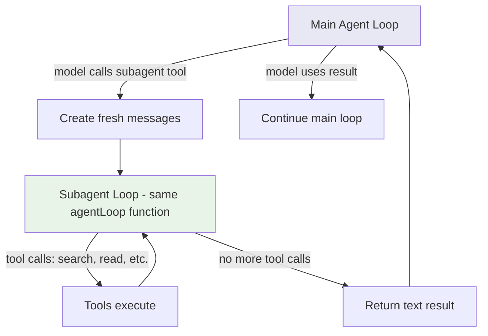

# Chapter 8: Subagents

## The problem

You ask the agent: "Update the API, then update the tests, then update the docs."

The agent reads 10 API files, 15 test files, and 8 doc files. All those file contents are now in the conversation history. By the time it gets to the docs, the context is full of API code that is no longer relevant.

Complex tasks have subtasks that do not need each other's context. The API exploration should not pollute the test-writing context. The test-writing should not pollute the doc-writing context.

## What is a subagent?

A subagent is just another instance of the same agentic loop running with its own conversation history. The main agent spawns it by calling a tool (like any other tool), gives it a prompt, and gets back a text result when it is done.

The key idea: the subagent has its own messages array. Its tool calls and results stay in its own context, not the parent's. The parent only sees the final summary the subagent returns.

It is not a separate program or process. It is the same `agentLoop()` function called with a fresh messages array.

## Walkthrough: Delegating a search task

The main agent gets: "Find all the components that use the Button component and tell me about them."

Instead of doing the search itself (which would dump results into its own context), it delegates:

```
Main agent:
  [tool] subagent({
    prompt: "Search for all files that import Button. Read each one and
             summarize what it does with the Button component."
  })

  Subagent (its own loop):
    [tool] search_files({ pattern: "import.*Button", directory: "src" })
    [tool] read_file("src/pages/Home.tsx")
    [tool] read_file("src/pages/Settings.tsx")
    [tool] read_file("src/pages/Profile.tsx")
    Returns: "Found 3 components: Home uses Button for navigation,
             Settings uses it for form submission, Profile uses it
             for the edit action."

Main agent receives: "Found 3 components: Home uses Button for..."
```

The main agent's context stays clean. It only sees the summary, not the 3 full files the subagent read. The subagent did all the heavy reading in its own isolated context.

## Same function, isolated context

A subagent is not a separate program. It is the same agentic loop we built in Chapter 1, called with a fresh messages array:

```typescript
async function runSubagent(prompt: string): Promise<string> {
  // Fresh conversation, just the prompt
  const subagentMessages: Anthropic.MessageParam[] = [
    { role: "user", content: prompt },
  ];

  // Run the same agentic loop with isolated messages
  return agentLoop(subagentMessages);
}
```

That is the core idea. The subagent calls the same `agentLoop()` function. It has access to the same tools (read, edit, search, etc.). But it has its own conversation history. Its tool results do not leak into the parent's context.

## Shared vs isolated

Not everything is isolated. Some things need to be shared:

| Component | Shared or Isolated | Why |
|---|---|---|
| **Messages** | Isolated | The whole point. Keep contexts separate. |
| **File read cache** | Cloned | The subagent gets a copy of what the parent has read so far (for staleness checks). New reads by the subagent do not flow back to the parent. |
| **Tools** | Shared | Both use the same tools. |
| **Abort signal** | Linked | If the user cancels, both parent and child should stop. |
| **Permission rules** | Shared | If the user said "always allow edit_file," that applies to subagents too. |

Here is how we set it up:

```typescript
async function runSubagent(
  prompt: string,
  parentAbortSignal?: AbortSignal
): Promise<string> {
  // Create a child abort controller linked to the parent
  const childAbort = new AbortController();
  if (parentAbortSignal) {
    parentAbortSignal.addEventListener("abort", () => childAbort.abort());
  }

  // Fresh messages, but shared everything else
  const subagentMessages: Anthropic.MessageParam[] = [
    { role: "user", content: prompt },
  ];

  return agentLoop(subagentMessages);
}
```

The messages are fresh. The abort signal is linked (parent cancel kills the child too). Everything else (tools, permissions, file state) is shared because it lives in module scope.

## The subagent tool

The subagent is itself a tool that the model can call:

```typescript
const subagentTool: Tool = {
  name: "subagent",
  description:
    "Delegate a task to a subagent. The subagent runs in its own context " +
    "and returns a summary. Use this for exploration, research, or " +
    "subtasks that would clutter your main context.",
  inputSchema: z.object({
    prompt: z.string().describe("The task for the subagent to perform"),
  }),
  checkPermissions() {
    return "allow"; // Subagents use the same permission rules
  },
  async call(input) {
    const prompt = input.prompt as string;
    console.log("  [subagent] Starting...");
    const result = await runSubagent(prompt);
    console.log("  [subagent] Done.");
    return result;
  },
};
```

The model decides when to use a subagent. It is just another tool in its toolbox. For big, exploratory tasks, it delegates. For simple, focused tasks, it acts directly.

## How it looks in practice



The parent and child both run `agentLoop()`. The child's tool calls and results stay in its own context. The parent only sees the final text the child returns.

## When to use subagents

Subagents are useful for:

- **Exploration**: "Find all files related to authentication" without dumping 20 file reads into the main context
- **Multi-part tasks**: "Update the API" and "Update the tests" as separate subagent calls
- **Background research**: Looking up patterns, reading documentation files, understanding code structure
- **Risky experiments**: If the subagent's approach fails, the main context is not polluted with failed attempts

Subagents are NOT useful for:

- **Simple tasks**: Reading one file and making one edit. The overhead of a subagent is not worth it.
- **Tasks that need parent context**: If the subagent needs to know what the parent already discussed, you would have to pass that context anyway, defeating the purpose.

## Max turns

Subagents should have a tighter turn limit than the main agent. A runaway subagent can burn tokens fast. Set a max of 10-15 turns for subagents versus 20-30 for the main agent:

```typescript
async function runSubagent(prompt: string): Promise<string> {
  const messages: Anthropic.MessageParam[] = [
    { role: "user", content: prompt },
  ];
  return agentLoop(messages, { maxTurns: 10 });
}
```

## What is still missing

Our agent works, but the user experience is rough. When the model thinks, the user stares at a blank screen. When it is reading a large file, nothing happens for seconds. In the next chapter, we will add streaming so the user sees responses as they are generated, token by token.

## Running the example

```bash
npm run example:08
```

Try:
- "Use a subagent to find all components in sample-project and describe each one"
- "What does each file in sample-project do?" (the model might delegate the exploration)
