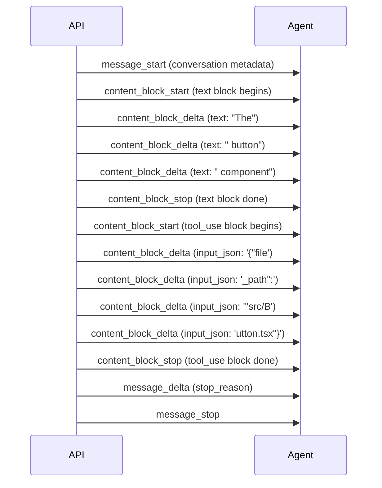

# Chapter 9: Streaming

## The problem

Without streaming, the user sends a message and stares at a blank screen. The model might take 5-10 seconds to generate a response. If it calls a tool, the model needs to generate the full tool input before anything happens. Then the tool executes. Then the model generates more text. The user sees nothing until everything is done.

Streaming fixes this. Text appears character by character as the model generates it. The user knows the agent is working. They can start reading before the response is complete.

## How streaming works

Instead of `client.messages.create()` which returns the complete response, we use `client.messages.stream()` which returns events as they happen:

```typescript
const stream = client.messages.stream({
  model: "claude-sonnet-4-20250514",
  max_tokens: 4096,
  messages: conversationHistory,
  tools: apiTools,
});
```

The stream emits events in this order:



## The event types

| Event | What it means |
|---|---|
| `message_start` | The response is starting. Contains metadata. |
| `content_block_start` | A new content block is starting (text or tool_use). |
| `content_block_delta` | A chunk of content. For text: a few words. For tool input: a piece of JSON. |
| `content_block_stop` | The current content block is complete. |
| `message_delta` | Final metadata like `stop_reason` and token usage. |
| `message_stop` | The response is done. |

## Streaming text

Text deltas are simple. Each `content_block_delta` event with `type: "text_delta"` carries a small piece of text. Print it immediately:

```typescript
for await (const event of stream) {
  if (
    event.type === "content_block_delta" &&
    event.delta.type === "text_delta"
  ) {
    process.stdout.write(event.delta.text); // Print without newline
  }
}
```

The user sees text appearing word by word. This feels much faster than waiting for the complete response, even though the total time is the same.

## Streaming tool inputs

Tool inputs are trickier. The model generates the tool's JSON input incrementally. Each `input_json_delta` event carries a piece of the JSON string:

```
Delta 1: '{"file'
Delta 2: '_path":'
Delta 3: '"src/'
Delta 4: 'Button.tsx"}'
```

You cannot parse incomplete JSON. So you buffer the deltas and parse when the block is complete:

```typescript
let toolInputBuffer = "";

for await (const event of stream) {
  if (event.type === "content_block_start" && event.content_block.type === "tool_use") {
    toolInputBuffer = "";  // Reset buffer for new tool
  }

  if (event.type === "content_block_delta" && event.delta.type === "input_json_delta") {
    toolInputBuffer += event.delta.partial_json;  // Buffer the pieces
  }

  if (event.type === "content_block_stop") {
    // Now we can parse the complete JSON
    const input = toolInputBuffer ? JSON.parse(toolInputBuffer) : {};
    // Execute the tool with the parsed input
  }
}
```

## Rewriting the loop for streaming

The agentic loop changes from `create()` to `stream()`. We need to accumulate the full response (for conversation history) while also streaming text to the user:

```typescript
async function agentLoop(messages: Anthropic.MessageParam[]): Promise<string> {
  while (true) {
    const stream = client.messages.stream({
      model: "claude-sonnet-4-20250514",
      max_tokens: 4096,
      system: SYSTEM_PROMPT,
      tools: apiTools,
      messages,
    });

    // Accumulate the complete response for conversation history
    const contentBlocks: Anthropic.ContentBlock[] = [];
    let currentToolInput = "";
    let currentToolId = "";
    let currentToolName = "";

    for await (const event of stream) {
      switch (event.type) {
        case "content_block_start":
          if (event.content_block.type === "text") {
            contentBlocks.push({ ...event.content_block, text: "" });
          } else if (event.content_block.type === "tool_use") {
            currentToolId = event.content_block.id;
            currentToolName = event.content_block.name;
            currentToolInput = "";
          }
          break;

        case "content_block_delta":
          if (event.delta.type === "text_delta") {
            // Stream text to the user immediately
            process.stdout.write(event.delta.text);
            // Also accumulate for history
            const lastBlock = contentBlocks[contentBlocks.length - 1];
            if (lastBlock?.type === "text") {
              lastBlock.text += event.delta.text;
            }
          } else if (event.delta.type === "input_json_delta") {
            currentToolInput += event.delta.partial_json;
          }
          break;

        case "content_block_stop":
          if (currentBlockType === "tool_use") {
            contentBlocks.push({
              type: "tool_use",
              id: currentToolId,
              name: currentToolName,
              input: currentToolInput ? JSON.parse(currentToolInput) : {},
            });
            currentToolInput = "";
          }
          currentBlockType = null;
          break;
      }
    }

    // Add complete response to history
    messages.push({ role: "assistant", content: contentBlocks });

    // Check for tool use (same as before)
    const toolBlocks = contentBlocks.filter(b => b.type === "tool_use");
    if (toolBlocks.length === 0) {
      return contentBlocks
        .filter((b): b is Anthropic.TextBlock => b.type === "text")
        .map(b => b.text).join("\n");
    }

    // Execute tools and continue (same as before)
    // ...
  }
}
```

The key change is in the inner loop. We iterate over stream events instead of waiting for a complete response. Text is printed as it arrives. Tool inputs are buffered until complete.

## What the user sees

Without streaming:
```
> What does the Button component do?
(10 second pause...)
The Button component accepts a label and onClick handler...
```

With streaming:
```
> What does the Button component do?
  [tool] read_file({"file_path":"sample-project/src/components/Button.tsx"})
  [result] 1  interface ButtonProps { ...
The| Button| component| accepts| a| label| and| onClick| handler|...
```

Each `|` represents where a new chunk appeared. The user sees the response building up in real time.

## Using the SDK helper

Most LLM SDKs provide helpers for streaming. For example, the Anthropic SDK has a `finalMessage()` helper to get the complete response after streaming:

```typescript
const stream = client.messages.stream({ ... });

// Stream text to the user
stream.on("text", (text) => {
  process.stdout.write(text);
});

// Get the complete message when done
const finalMessage = await stream.finalMessage();
```

This is easier for simple cases. For our agentic loop, we need more control (to detect tool_use blocks during streaming), so we use the raw event approach.

## Streaming thinking blocks

Many LLMs now support "thinking" or "reasoning" where the model shows its thought process before responding. When enabled, the model produces a `thinking` content block before the `text` or `tool_use` blocks.

Thinking blocks stream the same way as text, just with a different delta type:

- `content_block_start` with `type: "thinking"` signals a thinking block
- `content_block_delta` with `type: "thinking_delta"` carries chunks of the model's reasoning
- `content_block_stop` ends the thinking block

```typescript
case "content_block_start":
  if (event.content_block.type === "thinking") {
    // A thinking block is starting
    console.log("  [thinking...]");
  }
  break;

case "content_block_delta":
  if (event.delta.type === "thinking_delta") {
    // The model is reasoning. You can show this or hide it.
    // Some agents show a spinner, some show the full thought process.
    process.stdout.write(event.delta.thinking);
  }
  break;
```

Whether to show thinking to the user is a design choice. Some agents display it in a collapsible section. Some show a spinner with "Thinking..." and hide the content. Some skip it entirely. The thinking block does not need to go into the conversation history for the agentic loop to work. It is the `text` and `tool_use` blocks that matter.

One thing to note: some providers also have "redacted thinking" blocks where the model thought about something but the content is hidden from you. You get a block with `type: "redacted_thinking"` but no actual text. Just acknowledge it and move on.

## What is still missing

When the model calls 3 tools at once (like reading 3 files), we execute them one at a time. But Read is a safe, read-only operation. We could run all 3 in parallel and save time. That is the topic of the next chapter.

## Running the example

```bash
npm run example:09
```

Watch how text appears incrementally instead of all at once. Compare the experience with earlier examples.

## The full code

Here is everything from this chapter in one file (`examples/09-with-streaming.ts`):

```typescript
// This example focuses on: streaming (Chapter 9).
// Includes: tools (Ch2), edit (Ch3), system prompt (Ch4), context (Ch5), compression (Ch6).
// Omits: permissions (Ch7), subagents (Ch8) to keep the code focused on streaming.

import Anthropic from "@anthropic-ai/sdk";
import { z } from "zod";
import * as fs from "fs";
import * as path from "path";
import { execSync } from "child_process";
import * as readline from "readline";

const client = new Anthropic();

const SYSTEM_PROMPT = `You are a coding assistant. Use list_files and search_files to find files before editing. Always read before editing. Be concise.`;

// --- Types ---
interface Tool {
  name: string;
  description: string;
  inputSchema: z.ZodObject<any>;
  call(input: Record<string, unknown>): Promise<string>;
}

const readTimestamps = new Map<string, number>();
const MAX_RESULT_CHARS = 10_000;

function truncateResult(result: string): string {
  if (result.length <= MAX_RESULT_CHARS) return result;
  return result.slice(0, MAX_RESULT_CHARS) + `\n[Truncated]`;
}

function findActualString(fc: string, ss: string): string | null {
  if (fc.includes(ss)) return ss;
  const n = (s: string) => s.replace(/[\u2018\u2019]/g, "'").replace(/[\u201C\u201D]/g, '"');
  const i = n(fc).indexOf(n(ss));
  return i !== -1 ? fc.substring(i, i + ss.length) : null;
}

function zodToJsonSchema(schema: z.ZodObject<any>): Record<string, unknown> {
  const shape = schema.shape;
  const properties: Record<string, unknown> = {};
  const required: string[] = [];
  for (const [key, value] of Object.entries(shape)) {
    const zv = value as z.ZodTypeAny;
    const opt = zv.isOptional();
    const inner = opt ? (zv as z.ZodOptional<any>)._def.innerType : zv;
    properties[key] = { type: inner instanceof z.ZodBoolean ? "boolean" : "string", description: inner._def.description || "" };
    if (!opt) required.push(key);
  }
  return { type: "object", properties, required };
}

// --- Tools ---
const tools: Tool[] = [
  {
    name: "read_file", description: "Read a file with line numbers.",
    inputSchema: z.object({ file_path: z.string() }),
    async call(input) {
      const fp = input.file_path as string;
      try {
        const c = fs.readFileSync(fp, "utf-8");
        readTimestamps.set(path.resolve(fp), Date.now());
        return truncateResult(c.split("\n").map((l, i) => `${i + 1}\t${l}`).join("\n"));
      } catch (e: any) { return `Error: ${e.message}`; }
    },
  },
  {
    name: "edit_file", description: "Edit a file by replacing old_string with new_string.",
    inputSchema: z.object({ file_path: z.string(), old_string: z.string(), new_string: z.string(), replace_all: z.boolean().optional() }),
    async call(input) {
      const { file_path: fp, old_string: os, new_string: ns, replace_all: ra } = input as any;
      if (os === ns) return "Error: identical.";
      if (!fs.existsSync(fp)) return "Error: not found.";
      const c = fs.readFileSync(fp, "utf-8");
      const a = findActualString(c, os);
      if (!a) return "Error: not found in file.";
      if (!ra && c.split(a).length - 1 > 1) return "Error: multiple matches.";
      const u = ra ? c.split(a).join(ns) : c.replace(a, ns);
      fs.writeFileSync(fp, u);
      readTimestamps.set(path.resolve(fp), Date.now());
      return `Edited ${fp}`;
    },
  },
  {
    name: "write_file", description: "Create or overwrite a file.",
    inputSchema: z.object({ file_path: z.string(), content: z.string() }),
    async call(input) {
      const fp = input.file_path as string;
      fs.mkdirSync(path.dirname(fp), { recursive: true });
      fs.writeFileSync(fp, input.content as string);
      return `Written: ${fp}`;
    },
  },
  {
    name: "list_files", description: "List files recursively.",
    inputSchema: z.object({ directory: z.string().optional() }),
    async call(input) {
      const dir = (input.directory as string) || ".";
      const files: string[] = [];
      function walk(d: string) {
        try {
          for (const e of fs.readdirSync(d, { withFileTypes: true })) {
            if (e.name.startsWith(".") || e.name === "node_modules") continue;
            const f = path.join(d, e.name);
            if (e.isDirectory()) walk(f); else files.push(f);
          }
        } catch {}
      }
      walk(dir);
      return files.join("\n") || "(empty)";
    },
  },
  {
    name: "search_files", description: "Search for a regex pattern in files.",
    inputSchema: z.object({ pattern: z.string(), directory: z.string().optional() }),
    async call(input) {
      const dir = (input.directory as string) || ".";
      const rx = new RegExp(input.pattern as string);
      const res: string[] = [];
      function s(d: string) {
        try {
          for (const e of fs.readdirSync(d, { withFileTypes: true })) {
            if (e.name.startsWith(".") || e.name === "node_modules") continue;
            const f = path.join(d, e.name);
            if (e.isDirectory()) { s(f); } else {
              try { fs.readFileSync(f, "utf-8").split("\n").forEach((l, i) => {
                if (rx.test(l)) res.push(`${f}:${i + 1}: ${l.trim()}`);
              }); } catch {}
            }
          }
        } catch {}
      }
      s(dir);
      return truncateResult(res.slice(0, 50).join("\n") || "No matches.");
    },
  },
  {
    name: "run_command", description: "Run a shell command.",
    inputSchema: z.object({ command: z.string() }),
    async call(input) {
      try {
        return truncateResult(execSync(input.command as string, { encoding: "utf-8", timeout: 30_000, maxBuffer: 1024 * 1024 }) || "(no output)");
      } catch (e: any) { return `Error: ${e.stderr || e.message}`; }
    },
  },
];

const apiTools: Anthropic.Tool[] = tools.map((t) => ({
  name: t.name,
  description: t.description,
  input_schema: zodToJsonSchema(t.inputSchema) as Anthropic.Tool["input_schema"],
}));

// --- Streaming agentic loop ---
// The main difference from previous chapters: we use client.messages.stream()
// instead of client.messages.create(). Text is printed as it arrives.

async function agentLoop(
  messages: Anthropic.MessageParam[]
): Promise<string> {
  let turns = 0;
  const maxTurns = 20;

  while (true) {
    turns++;
    if (turns > maxTurns) return "[max turns reached]";

    // Use streaming API instead of create()
    const stream = client.messages.stream({
      model: "claude-sonnet-4-20250514",
      max_tokens: 4096,
      system: SYSTEM_PROMPT,
      tools: apiTools,
      messages,
    });

    // Accumulate content blocks while streaming text to the user
    const contentBlocks: any[] = [];
    let currentBlockType: string | null = null;
    let currentToolInput = "";
    let currentToolId = "";
    let currentToolName = "";
    let currentTextIndex = -1;

    for await (const event of stream) {
      switch (event.type) {
        case "content_block_start":
          if (event.content_block.type === "text") {
            currentBlockType = "text";
            currentTextIndex = contentBlocks.length;
            contentBlocks.push({ type: "text", text: "" });
          } else if (event.content_block.type === "tool_use") {
            currentBlockType = "tool_use";
            currentToolId = event.content_block.id;
            currentToolName = event.content_block.name;
            currentToolInput = "";
          }
          break;

        case "content_block_delta":
          if (event.delta.type === "text_delta") {
            // Stream text to the user immediately
            process.stdout.write(event.delta.text);
            // Accumulate for history
            if (currentTextIndex >= 0) {
              contentBlocks[currentTextIndex].text += event.delta.text;
            }
          } else if (event.delta.type === "input_json_delta") {
            // Buffer tool input (cannot parse until complete)
            currentToolInput += event.delta.partial_json;
          }
          break;

        case "content_block_stop":
          if (currentBlockType === "tool_use") {
            try {
              contentBlocks.push({
                type: "tool_use",
                id: currentToolId,
                name: currentToolName,
                input: currentToolInput ? JSON.parse(currentToolInput) : {},
              });
            } catch {
              contentBlocks.push({
                type: "tool_use",
                id: currentToolId,
                name: currentToolName,
                input: {},
              });
            }
            currentToolInput = "";
          }
          currentBlockType = null;
          break;
      }
    }

    // Add the complete response to conversation history
    messages.push({ role: "assistant", content: contentBlocks });

    // Check for tool use
    const toolBlocks = contentBlocks.filter(
      (b: any) => b.type === "tool_use"
    ) as Anthropic.ToolUseBlock[];

    if (toolBlocks.length === 0) {
      // No tools. Return the accumulated text.
      process.stdout.write("\n");
      return contentBlocks
        .filter((b: any) => b.type === "text")
        .map((b: any) => b.text)
        .join("\n");
    }

    // Execute tools
    const toolResults: Anthropic.ToolResultBlockParam[] = [];

    for (const toolUse of toolBlocks) {
      const tool = tools.find((t) => t.name === toolUse.name);
      if (!tool) {
        toolResults.push({ type: "tool_result", tool_use_id: toolUse.id, content: `Unknown: ${toolUse.name}`, is_error: true });
        continue;
      }

      const parsed = tool.inputSchema.safeParse(toolUse.input);
      if (!parsed.success) {
        toolResults.push({ type: "tool_result", tool_use_id: toolUse.id, content: `Invalid: ${parsed.error.message}`, is_error: true });
        continue;
      }

      console.log(`\n  [tool] ${tool.name}(${JSON.stringify(toolUse.input).slice(0, 100)})`);
      const result = await tool.call(parsed.data);
      console.log(`  [result] ${result.slice(0, 150)}${result.length > 150 ? "..." : ""}`);
      toolResults.push({ type: "tool_result", tool_use_id: toolUse.id, content: result });
    }

    messages.push({ role: "user", content: toolResults });
  }
}

// --- REPL ---
async function main() {
  const conversationHistory: Anthropic.MessageParam[] = [];
  const rl = readline.createInterface({ input: process.stdin, output: process.stdout });

  console.log("Streaming agent. Text appears token by token.");
  console.log('Try: "Explain what the Button component does in sample-project"\n');

  const ask = () => {
    rl.question("> ", async (input) => {
      const trimmed = input.trim();
      if (!trimmed) return ask();
      conversationHistory.push({ role: "user", content: trimmed });
      console.log("");
      await agentLoop(conversationHistory);
      console.log("");
      ask();
    });
  };
  ask();
}

main();

```
