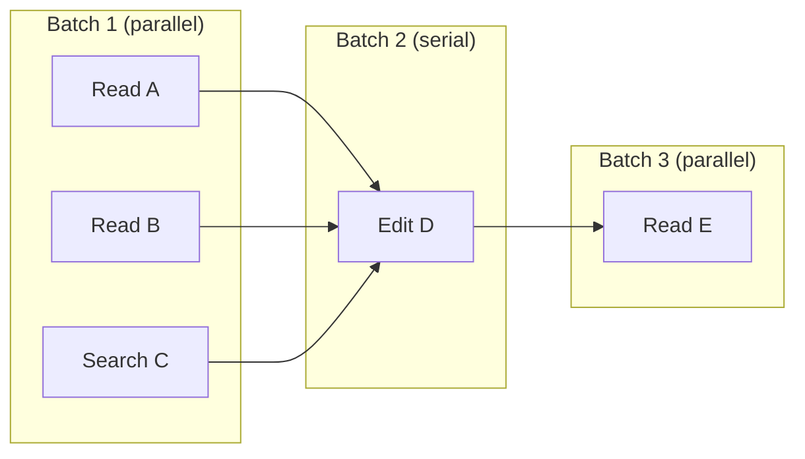

# Chapter 10: Concurrent Tool Execution

## The problem

The model calls `read_file` on three different files in a single response. Each file read takes 50ms. Running them one at a time: 150ms. Running them all at once: 50ms. Three times faster.

But what about `edit_file`? If two edits target the same file, running them in parallel could corrupt the file. One edit might overwrite the other.

We need to know which tools are safe to run in parallel and which are not.

## The concurrency flag

Each tool declares whether it is safe to run alongside other tools:

```typescript
interface Tool {
  name: string;
  // ... other fields
  isConcurrencySafe: boolean;
}
```

The rule is simple:

| Tool | Concurrent? | Why |
|---|---|---|
| read_file | Yes | Reading does not change state |
| list_files | Yes | Listing does not change state |
| search_files | Yes | Searching does not change state |
| edit_file | No | Two edits could conflict |
| write_file | No | Two writes could conflict |
| run_command | Usually no | Commands can change state, affect the filesystem, share environment |

Read-only tools are safe to parallelize. Tools that change state are not.

In practice, the flag can depend on the input. A shell command like `cat file.txt` is read-only and could be safe. Production agents check if a command is read-only and allow concurrency in that case. For simplicity, we mark all shell commands as unsafe. You can refine this later.

## Partitioning into batches

When the model returns multiple tool calls in one response, we group them into batches:

```
Tool calls from model:  [Read A, Read B, Search C, Edit D, Read E]

Batch 1: [Read A, Read B, Search C]  <- all concurrent-safe, run in parallel
Batch 2: [Edit D]                     <- not safe, run alone
Batch 3: [Read E]                     <- safe, but must wait for Edit D
```

The algorithm walks through the tool calls left to right:

```typescript
interface Batch {
  tools: ToolCall[];
  concurrent: boolean;
}

function partitionIntoBatches(toolCalls: ToolCall[]): Batch[] {
  const batches: Batch[] = [];
  let currentBatch: ToolCall[] = [];
  let currentIsConcurrent = true;

  for (const call of toolCalls) {
    const tool = tools.find(t => t.name === call.name);
    const isSafe = tool?.isConcurrencySafe ?? false;

    if (isSafe && currentIsConcurrent) {
      // Add to current concurrent batch
      currentBatch.push(call);
    } else {
      // Flush current batch if it has items
      if (currentBatch.length > 0) {
        batches.push({ tools: currentBatch, concurrent: currentIsConcurrent });
      }
      // Start new batch
      currentBatch = [call];
      currentIsConcurrent = isSafe;
    }
  }

  // Flush the last batch
  if (currentBatch.length > 0) {
    batches.push({ tools: currentBatch, concurrent: currentIsConcurrent });
  }

  return batches;
}
```

## Executing batches

Concurrent batches use `Promise.all()`. Non-concurrent batches run one tool at a time:

```typescript
async function executeBatches(batches: Batch[]): Promise<ToolResult[]> {
  const allResults: ToolResult[] = [];

  for (const batch of batches) {
    if (batch.concurrent) {
      // Run all tools in this batch at the same time
      const results = await Promise.all(
        batch.tools.map(call => executeTool(call))
      );
      allResults.push(...results);
    } else {
      // Run tools one at a time
      for (const call of batch.tools) {
        const result = await executeTool(call);
        allResults.push(result);
      }
    }
  }

  return allResults;
}
```

## Visualized



Batch 1 runs all three tools at the same time. When all three are done, Batch 2 runs the edit alone. Then Batch 3 runs the final read.

## Order preservation

Even though tools in a concurrent batch finish at different times, results must be returned in the original order. The model expects results to match the order of its tool calls.

`Promise.all()` already handles this. It returns results in the same order as the input promises, regardless of which one resolved first.

```typescript
const results = await Promise.all([
  readFile("A.tsx"),  // Finishes 3rd (slow file)
  readFile("B.tsx"),  // Finishes 1st (small file)
  searchFiles("C"),   // Finishes 2nd
]);

// results[0] = A.tsx contents (matches input order)
// results[1] = B.tsx contents
// results[2] = search results
```

## Error handling

When a tool in a batch fails, what happens to the other tools?

For read-only tools, errors are independent. If Read A fails but Read B succeeds, there is no problem. Return the error for A and the result for B.

For shell commands, it is different. If a batch contained a `run_command` that fails (like a build step), sibling tools running in the same batch might be in an inconsistent state. Production agents abort sibling tools when a shell command fails.

For our simple version, we let each tool handle its own errors:

```typescript
const results = await Promise.all(
  batch.tools.map(async (call) => {
    try {
      return await executeTool(call);
    } catch (err) {
      return { toolUseId: call.id, content: `Error: ${err}`, isError: true };
    }
  })
);
```

Each tool call is wrapped in a try/catch. A failure in one does not affect the others.

## Performance impact

The improvement depends on the workload:

| Scenario | Sequential | Concurrent | Speedup |
|---|---|---|---|
| Read 3 small files | 150ms | 50ms | 3x |
| Read + Search + List | 200ms | 80ms | 2.5x |
| Read 1 file, Edit 1 file | 100ms | 100ms | 1x (cannot parallelize) |
| 5 reads + 1 edit + 3 reads | 450ms | 200ms | 2.25x |

The bigger the batch of concurrent-safe tools, the bigger the win. If the model calls mostly reads and searches (which is common during exploration), concurrency makes a noticeable difference.

## What is still missing

Nothing! This is the final feature layer. You now have a complete AI coding agent with:

- An agentic loop (Chapter 1)
- Tools for reading, editing, searching, and running commands (Chapters 2-3)
- A system prompt that guides behavior (Chapter 4)
- Context management and compression (Chapters 5-6)
- A permission system (Chapter 7)
- Subagents for delegation (Chapter 8)
- Streaming for real-time output (Chapter 9)
- Concurrent tool execution (this chapter)

The next and final chapter wraps up with ideas for where to go from here.

## Running the example

```bash
npm run example:10
```

Ask the agent to read multiple files and watch the logs. Concurrent reads will execute in a single batch instead of one at a time:

```
  [batch] Executing 3 tools concurrently
  [tool] read_file("src/App.tsx")
  [tool] read_file("src/components/Button.tsx")
  [tool] read_file("src/components/Header.tsx")
  [batch] All 3 completed
```
