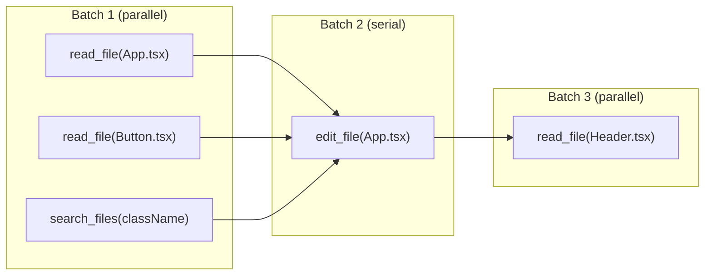

# Chapter 10: Concurrent Tool Execution

## The problem

In the previous chapters, the model usually calls one tool per turn. It calls `read_file`, gets the result, then decides what to do next. But the model can also call **multiple tools in a single turn**. Instead of one `tool_use` block in the response, it returns several:

```json
{
  "content": [
    { "type": "tool_use", "name": "read_file", "input": { "file_path": "A.tsx" } },
    { "type": "tool_use", "name": "read_file", "input": { "file_path": "B.tsx" } },
    { "type": "tool_use", "name": "read_file", "input": { "file_path": "C.tsx" } }
  ]
}
```

The model is saying: "I need all three files. Get them for me." Our loop already handles this. Remember the `for` loop from Chapter 1 that executes each tool?

```typescript
for (const toolUse of toolUseBlocks) {
  const result = await tool.call(toolUse.input);  // waits for each one
  toolResults.push({ ... });
}
```

It runs them one at a time because of `await`. Each tool waits for the previous one to finish. Each file read takes 50ms. Three reads: 150ms. If we run them at the same time: 50ms. Three times faster.

But what about `edit_file`? If two edits target the same file, running them in parallel could corrupt the file. One edit might overwrite the other.

We need to know which tools are safe to run in parallel and which are not.

## The concurrency flag

Each tool declares whether it is safe to run alongside other tools:

```typescript
interface Tool {
  name: string;
  // ... other fields
  isConcurrencySafe: boolean;
}
```

The rule is simple:

| Tool | Concurrent? | Why |
|---|---|---|
| read_file | Yes | Reading does not change state |
| list_files | Yes | Listing does not change state |
| search_files | Yes | Searching does not change state |
| edit_file | No | Two edits could conflict |
| write_file | No | Two writes could conflict |
| run_command | Usually no | Commands can change state, affect the filesystem, share environment |

Read-only tools are safe to parallelize. Tools that change state are not.

In practice, the flag can depend on the input. A shell command like `cat file.txt` is read-only and could be safe. Production agents check if a command is read-only and allow concurrency in that case. For simplicity, we mark all shell commands as unsafe. You can refine this later.

## Partitioning into batches

When the model returns multiple tool calls in one response, we group them into batches:

```
Tool calls from the model (5 calls in one response):

  1. read_file("src/App.tsx")
  2. read_file("src/components/Button.tsx")
  3. search_files("className")
  4. edit_file("src/App.tsx", ...)
  5. read_file("src/components/Header.tsx")

Partitioned into batches:

  Batch 1: [read_file, read_file, search_files]  ← all safe, run in parallel
  Batch 2: [edit_file]                            ← not safe, run alone
  Batch 3: [read_file]                            ← safe, but must wait for the edit
```

The algorithm walks through the tool calls left to right:

```typescript
interface Batch {
  tools: ToolCall[];
  concurrent: boolean;
}

function partitionIntoBatches(toolCalls: ToolCall[]): Batch[] {
  const batches: Batch[] = [];
  let currentBatch: ToolCall[] = [];
  let currentIsConcurrent = true;

  for (const call of toolCalls) {
    const tool = tools.find(t => t.name === call.name);
    const isSafe = tool?.isConcurrencySafe ?? false;

    if (isSafe && currentIsConcurrent) {
      // Add to current concurrent batch
      currentBatch.push(call);
    } else {
      // Flush current batch if it has items
      if (currentBatch.length > 0) {
        batches.push({ tools: currentBatch, concurrent: currentIsConcurrent });
      }
      // Start new batch
      currentBatch = [call];
      currentIsConcurrent = isSafe;
    }
  }

  // Flush the last batch
  if (currentBatch.length > 0) {
    batches.push({ tools: currentBatch, concurrent: currentIsConcurrent });
  }

  return batches;
}
```

Using the example from earlier, the output would look like:

```typescript
[
  {
    concurrent: true,
    tools: [
      { name: "read_file", input: { file_path: "src/App.tsx" } },
      { name: "read_file", input: { file_path: "src/components/Button.tsx" } },
      { name: "search_files", input: { pattern: "className" } },
    ]
  },
  {
    concurrent: false,
    tools: [
      { name: "edit_file", input: { file_path: "src/App.tsx", ... } },
    ]
  },
  {
    concurrent: true,
    tools: [
      { name: "read_file", input: { file_path: "src/components/Header.tsx" } },
    ]
  },
]
```

Three batches. The first and third can run their tools in parallel. The second runs alone.

## Executing batches

Concurrent batches use `Promise.all()`. Non-concurrent batches run one tool at a time:

```typescript
async function executeBatches(batches: Batch[]): Promise<ToolResult[]> {
  const allResults: ToolResult[] = [];

  for (const batch of batches) {
    if (batch.concurrent) {
      // Run all tools in this batch at the same time
      const results = await Promise.all(
        batch.tools.map(call => executeTool(call))
      );
      allResults.push(...results);
    } else {
      // Run tools one at a time
      for (const call of batch.tools) {
        const result = await executeTool(call);
        allResults.push(result);
      }
    }
  }

  return allResults;
}
```

Our batch approach is simple and works well. Production agents often use a different mechanism: a **queue**. Instead of pre-grouping tools into batches, they walk through a list of queued tools and start each one if conditions allow. "Can this tool run right now?" If all currently running tools are safe and this one is also safe, start it. If not, wait.

The result is the same (safe tools run together, unsafe tools run alone) but the queue approach handles tools that arrive mid-execution better, since streaming can deliver tool calls one at a time while earlier tools are still running.

For learning purposes, batching is easier to understand. The queue approach is an optimization you can switch to later.

## Visualized



Batch 1 runs all three reads/searches at the same time. When all three are done, Batch 2 runs the edit alone. Then Batch 3 runs the final read.

## Order preservation

Even though tools in a concurrent batch finish at different times, results must be returned in the original order. The model expects results to match the order of its tool calls.

`Promise.all()` already handles this. It returns results in the same order as the input promises, regardless of which one resolved first.

```typescript
const results = await Promise.all([
  read_file("src/App.tsx"),              // Finishes 3rd (large file)
  read_file("src/components/Button.tsx"), // Finishes 1st (small file)
  search_files("className"),             // Finishes 2nd
]);

// results[0] = App.tsx contents (matches input order, not finish order)
// results[1] = Button.tsx contents
// results[2] = search results
```

## Error handling

When a tool in a batch fails, what happens to the other tools?

For read-only tools, errors are independent. If `read_file("App.tsx")` fails but `read_file("Button.tsx")` succeeds, there is no problem. Return the error for one and the result for the other.

For shell commands, it is different. If a batch contained a `run_command` that fails (like a build step), sibling tools running in the same batch might be in an inconsistent state. Production agents abort sibling tools when a shell command fails.

For our simple version, we let each tool handle its own errors:

```typescript
const results = await Promise.all(
  batch.tools.map(async (call) => {
    try {
      return await executeTool(call);
    } catch (err) {
      return { toolUseId: call.id, content: `Error: ${err}`, isError: true };
    }
  })
);
```

Each tool call is wrapped in a try/catch. A failure in one does not affect the others.

## Wiring it into the loop

In previous chapters, we executed tools one at a time in a `for` loop. Now we replace that with batch execution. The change is small:

```typescript
// Before (sequential):
for (const toolUse of toolBlocks) {
  const tool = tools.find(t => t.name === toolUse.name);
  const result = await tool.call(toolUse.input);
  toolResults.push({ type: "tool_result", tool_use_id: toolUse.id, content: result });
}

// After (concurrent):
const toolCalls = toolBlocks.map(block => ({
  block,
  tool: tools.find(t => t.name === block.name),
  input: block.input,
}));
const batches = partitionIntoBatches(toolCalls);
const toolResults = await executeBatches(batches);
```

Everything else in the agentic loop stays the same. The tool results still get pushed into the conversation as a user message. The loop still checks for tool_use blocks to decide whether to continue. The only difference is how the tools are executed between those steps.

## Performance impact

The improvement depends on the workload:

| Scenario | Sequential | Concurrent | Speedup |
|---|---|---|---|
| Read 3 small files | 150ms | 50ms | 3x |
| Read + Search + List | 200ms | 80ms | 2.5x |
| Read 1 file, Edit 1 file | 100ms | 100ms | 1x (cannot parallelize) |
| 5 reads + 1 edit + 3 reads | 450ms | 200ms | 2.25x |

The bigger the batch of concurrent-safe tools, the bigger the win. If the model calls mostly reads and searches (which is common during exploration), concurrency makes a noticeable difference.

## What is still missing

The core agent is complete. But it can only work with local files. In the next chapter, we give it access to the web so it can look up documentation, search for solutions, and read online references.

## Running the example

```bash
npm run example:10
```

Ask the agent to read multiple files and watch the logs. Concurrent reads will execute in a single batch instead of one at a time:

```
  [batch] Executing 3 tools concurrently
  [tool] read_file("src/App.tsx")
  [tool] read_file("src/components/Button.tsx")
  [tool] read_file("src/components/Header.tsx")
  [batch] All 3 completed
```

## The full code

Here is everything from this chapter in one file (`examples/10-with-concurrency.ts`):

```typescript
// This example focuses on: concurrent tool execution (Chapter 10).
// Includes: tools (Ch2), edit (Ch3), system prompt (Ch4), streaming (Ch9).
// Omits: permissions (Ch7), subagents (Ch8), compression (Ch6) to keep the code focused.

import Anthropic from "@anthropic-ai/sdk";
import { z } from "zod";
import * as fs from "fs";
import * as path from "path";
import { execSync } from "child_process";
import * as readline from "readline";

const client = new Anthropic();

const SYSTEM_PROMPT = `You are a coding assistant. Use list_files and search_files to find files before editing. Always read before editing. Be concise.

When you need to read multiple files, call all the read_file tools at once in a single response. This lets them run in parallel.`;

// --- Types ---
interface Tool {
  name: string;
  description: string;
  inputSchema: z.ZodObject<any>;
  isConcurrencySafe: boolean; // New: can this tool run in parallel with others?
  call(input: Record<string, unknown>): Promise<string>;
}

const readTimestamps = new Map<string, number>();
const MAX_RESULT_CHARS = 10_000;

function truncateResult(r: string): string {
  return r.length <= MAX_RESULT_CHARS ? r : r.slice(0, MAX_RESULT_CHARS) + "\n[Truncated]";
}

function findActualString(fc: string, ss: string): string | null {
  if (fc.includes(ss)) return ss;
  const n = (s: string) => s.replace(/[\u2018\u2019]/g, "'").replace(/[\u201C\u201D]/g, '"');
  const i = n(fc).indexOf(n(ss));
  return i !== -1 ? fc.substring(i, i + ss.length) : null;
}

function zodToJsonSchema(schema: z.ZodObject<any>): Record<string, unknown> {
  const shape = schema.shape;
  const properties: Record<string, unknown> = {};
  const required: string[] = [];
  for (const [key, value] of Object.entries(shape)) {
    const zv = value as z.ZodTypeAny;
    const opt = zv.isOptional();
    const inner = opt ? (zv as z.ZodOptional<any>)._def.innerType : zv;
    properties[key] = { type: inner instanceof z.ZodBoolean ? "boolean" : "string", description: inner._def.description || "" };
    if (!opt) required.push(key);
  }
  return { type: "object", properties, required };
}

// --- Tools (with concurrency flag) ---
const tools: Tool[] = [
  {
    name: "read_file", description: "Read a file with line numbers.",
    inputSchema: z.object({ file_path: z.string() }),
    isConcurrencySafe: true, // Reading is safe to parallelize
    async call(input) {
      const fp = input.file_path as string;
      try {
        const c = fs.readFileSync(fp, "utf-8");
        readTimestamps.set(path.resolve(fp), Date.now());
        return truncateResult(c.split("\n").map((l, i) => `${i + 1}\t${l}`).join("\n"));
      } catch (e: any) { return `Error: ${e.message}`; }
    },
  },
  {
    name: "edit_file", description: "Edit a file by replacing old_string with new_string.",
    inputSchema: z.object({ file_path: z.string(), old_string: z.string(), new_string: z.string(), replace_all: z.boolean().optional() }),
    isConcurrencySafe: false, // Editing is NOT safe to parallelize
    async call(input) {
      const { file_path: fp, old_string: os, new_string: ns, replace_all: ra } = input as any;
      if (os === ns) return "Error: identical.";
      if (!fs.existsSync(fp)) return "Error: not found.";
      const c = fs.readFileSync(fp, "utf-8");
      const a = findActualString(c, os);
      if (!a) return "Error: not found in file.";
      if (!ra && c.split(a).length - 1 > 1) return "Error: multiple matches.";
      const u = ra ? c.split(a).join(ns) : c.replace(a, ns);
      fs.writeFileSync(fp, u);
      readTimestamps.set(path.resolve(fp), Date.now());
      return `Edited ${fp}`;
    },
  },
  {
    name: "write_file", description: "Create or overwrite a file.",
    inputSchema: z.object({ file_path: z.string(), content: z.string() }),
    isConcurrencySafe: false,
    async call(input) {
      const fp = input.file_path as string;
      fs.mkdirSync(path.dirname(fp), { recursive: true });
      fs.writeFileSync(fp, input.content as string);
      return `Written: ${fp}`;
    },
  },
  {
    name: "list_files", description: "List files recursively.",
    inputSchema: z.object({ directory: z.string().optional() }),
    isConcurrencySafe: true,
    async call(input) {
      const dir = (input.directory as string) || ".";
      const files: string[] = [];
      function walk(d: string) {
        try {
          for (const e of fs.readdirSync(d, { withFileTypes: true })) {
            if (e.name.startsWith(".") || e.name === "node_modules") continue;
            const f = path.join(d, e.name);
            if (e.isDirectory()) walk(f); else files.push(f);
          }
        } catch {}
      }
      walk(dir);
      return files.join("\n") || "(empty)";
    },
  },
  {
    name: "search_files", description: "Search for a regex pattern in files.",
    inputSchema: z.object({ pattern: z.string(), directory: z.string().optional() }),
    isConcurrencySafe: true,
    async call(input) {
      const dir = (input.directory as string) || ".";
      const rx = new RegExp(input.pattern as string);
      const res: string[] = [];
      function s(d: string) {
        try {
          for (const e of fs.readdirSync(d, { withFileTypes: true })) {
            if (e.name.startsWith(".") || e.name === "node_modules") continue;
            const f = path.join(d, e.name);
            if (e.isDirectory()) { s(f); } else {
              try { fs.readFileSync(f, "utf-8").split("\n").forEach((l, i) => {
                if (rx.test(l)) res.push(`${f}:${i + 1}: ${l.trim()}`);
              }); } catch {}
            }
          }
        } catch {}
      }
      s(dir);
      return truncateResult(res.slice(0, 50).join("\n") || "No matches.");
    },
  },
  {
    name: "run_command", description: "Run a shell command.",
    inputSchema: z.object({ command: z.string() }),
    isConcurrencySafe: false, // Commands can change state
    async call(input) {
      try {
        return truncateResult(execSync(input.command as string, { encoding: "utf-8", timeout: 30_000, maxBuffer: 1024 * 1024 }) || "(no output)");
      } catch (e: any) { return `Error: ${e.stderr || e.message}`; }
    },
  },
];

const apiTools: Anthropic.Tool[] = tools.map((t) => ({
  name: t.name, description: t.description,
  input_schema: zodToJsonSchema(t.inputSchema) as Anthropic.Tool["input_schema"],
}));

// --- Batch partitioning ---
// Groups consecutive concurrent-safe tools into parallel batches.
// Non-safe tools each become their own serial batch.

interface ToolCall {
  block: Anthropic.ToolUseBlock;
  tool: Tool;
  input: Record<string, unknown>;
}

interface Batch {
  calls: ToolCall[];
  concurrent: boolean;
}

function partitionIntoBatches(toolCalls: ToolCall[]): Batch[] {
  const batches: Batch[] = [];
  let currentCalls: ToolCall[] = [];
  let currentConcurrent = true;

  for (const call of toolCalls) {
    if (call.tool.isConcurrencySafe && currentConcurrent) {
      currentCalls.push(call);
    } else {
      if (currentCalls.length > 0) {
        batches.push({ calls: currentCalls, concurrent: currentConcurrent });
      }
      currentCalls = [call];
      currentConcurrent = call.tool.isConcurrencySafe;
    }
  }

  if (currentCalls.length > 0) {
    batches.push({ calls: currentCalls, concurrent: currentConcurrent });
  }

  return batches;
}

// --- Execute a single tool call ---
async function executeToolCall(call: ToolCall): Promise<Anthropic.ToolResultBlockParam> {
  try {
    const result = await call.tool.call(call.input);
    return { type: "tool_result", tool_use_id: call.block.id, content: result };
  } catch (err: any) {
    return { type: "tool_result", tool_use_id: call.block.id, content: `Error: ${err.message}`, is_error: true };
  }
}

// --- Execute batches with concurrency ---
async function executeBatches(batches: Batch[]): Promise<Anthropic.ToolResultBlockParam[]> {
  const allResults: Anthropic.ToolResultBlockParam[] = [];

  for (const batch of batches) {
    if (batch.concurrent && batch.calls.length > 1) {
      // Run all tools in this batch in parallel
      console.log(`  [batch] Executing ${batch.calls.length} tools concurrently`);
      for (const call of batch.calls) {
        console.log(`  [tool] ${call.tool.name}(${JSON.stringify(call.block.input).slice(0, 80)})`);
      }

      const results = await Promise.all(batch.calls.map(executeToolCall));

      for (let i = 0; i < results.length; i++) {
        const content = typeof results[i].content === "string" ? results[i].content as string : "";
        console.log(`  [result] ${batch.calls[i].tool.name}: ${content.slice(0, 100)}${content.length > 100 ? "..." : ""}`);
      }
      console.log(`  [batch] All ${batch.calls.length} completed`);

      allResults.push(...results);
    } else {
      // Run tools one at a time
      for (const call of batch.calls) {
        console.log(`  [tool] ${call.tool.name}(${JSON.stringify(call.block.input).slice(0, 80)})`);
        const result = await executeToolCall(call);
        const content = typeof result.content === "string" ? result.content as string : "";
        console.log(`  [result] ${content.slice(0, 100)}${content.length > 100 ? "..." : ""}`);
        allResults.push(result);
      }
    }
  }

  return allResults;
}

// --- Streaming agentic loop with concurrent tool execution ---

async function agentLoop(messages: Anthropic.MessageParam[]): Promise<string> {
  let turns = 0;
  const maxTurns = 20;

  while (true) {
    turns++;
    if (turns > maxTurns) return "[max turns reached]";

    const stream = client.messages.stream({
      model: "claude-sonnet-4-20250514",
      max_tokens: 4096,
      system: SYSTEM_PROMPT,
      tools: apiTools,
      messages,
    });

    // Accumulate content blocks
    const contentBlocks: any[] = [];
    let currentBlockType: string | null = null;
    let currentToolInput = "";
    let currentToolId = "";
    let currentToolName = "";
    let currentTextIndex = -1;

    for await (const event of stream) {
      switch (event.type) {
        case "content_block_start":
          if (event.content_block.type === "text") {
            currentBlockType = "text";
            currentTextIndex = contentBlocks.length;
            contentBlocks.push({ type: "text", text: "" });
          } else if (event.content_block.type === "tool_use") {
            currentBlockType = "tool_use";
            currentToolId = event.content_block.id;
            currentToolName = event.content_block.name;
            currentToolInput = "";
          }
          break;
        case "content_block_delta":
          if (event.delta.type === "text_delta") {
            process.stdout.write(event.delta.text);
            if (currentTextIndex >= 0) contentBlocks[currentTextIndex].text += event.delta.text;
          } else if (event.delta.type === "input_json_delta") {
            currentToolInput += event.delta.partial_json;
          }
          break;
        case "content_block_stop":
          if (currentBlockType === "tool_use") {
            try {
              contentBlocks.push({ type: "tool_use", id: currentToolId, name: currentToolName, input: currentToolInput ? JSON.parse(currentToolInput) : {} });
            } catch {
              contentBlocks.push({ type: "tool_use", id: currentToolId, name: currentToolName, input: {} });
            }
            currentToolInput = "";
          }
          currentBlockType = null;
          break;
      }
    }

    messages.push({ role: "assistant", content: contentBlocks });

    const toolBlocks = contentBlocks.filter((b: any) => b.type === "tool_use") as Anthropic.ToolUseBlock[];
    if (toolBlocks.length === 0) {
      process.stdout.write("\n");
      return contentBlocks.filter((b: any) => b.type === "text").map((b: any) => b.text).join("\n");
    }

    // Prepare tool calls with their tool definitions
    const toolCalls: ToolCall[] = [];
    for (const block of toolBlocks) {
      const tool = tools.find((t) => t.name === block.name);
      if (!tool) {
        toolCalls.push({ block, tool: tools[0], input: {} }); // Will error
        continue;
      }
      const parsed = tool.inputSchema.safeParse(block.input);
      toolCalls.push({ block, tool, input: parsed.success ? parsed.data : {} });
    }

    // Partition into batches and execute with concurrency
    const batches = partitionIntoBatches(toolCalls);
    const toolResults = await executeBatches(batches);

    messages.push({ role: "user", content: toolResults });
  }
}

// --- REPL ---
async function main() {
  const conversationHistory: Anthropic.MessageParam[] = [];
  const rl = readline.createInterface({ input: process.stdin, output: process.stdout });

  console.log("Agent with concurrent tool execution.");
  console.log("Safe tools (read, search, list) run in parallel.");
  console.log('Try: "Read all three files in sample-project/src/components and sample-project/src/App.tsx"\n');

  const ask = () => {
    rl.question("> ", async (input) => {
      const trimmed = input.trim();
      if (!trimmed) return ask();
      conversationHistory.push({ role: "user", content: trimmed });
      console.log("");
      await agentLoop(conversationHistory);
      console.log("");
      ask();
    });
  };
  ask();
}

main();

```
